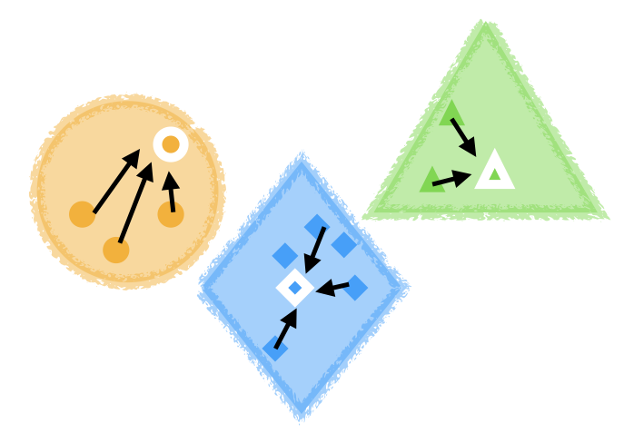

# Homework Assignment 1

**Due Wednesday, January 24, 2023 at 11:59pm (Pacific Time)**


## Instructions

1. Clone this directory to your local machine.
2. Install OCaml following [this guide](https://github.com/fredfeng/CS162/tree/master/sections/sec01). Report any issues you encounter in the `#tech-support` channel on Slack.
3. Run `opam install . --deps-only` in the root directory of this homework to install the necessary dependencies.
4. Complete `part1.ml` through `part4.ml` by replacing the placeholders denoted by `todo ()` with your own code. You may add additional helper functions if you wish, but you must not change the type signatures of the original functions. Otherwise, your program will not compile. If you accidentally change the type signatures, you can refer to the corresponding `part<i>.mli` file to see what the expected type signatures are.
5. Once you're done, submit `part1.ml` through `part4.ml` to Gradescope. If your program contains print statements, please remove them before submitting. You do not need to submit any other file, including any `.mli` file or test code. The autograder will automatically compile your code together with our testing infrastructure and run the tests.


**Important notes**:
* Problems marked with `📝` are pencil-and-paper problems and are ungraded. There are 4 of them in total. You do not need to submit your solution. The goal is to review concepts that will help you solve subsequent problems, and/or to give you some practice with the kinds of questions that will appear on the midterm. Solutions to these problems will be released by the TAs and discussed in sections.
* Problems marked with `🧑‍💻` are programming tasks, and will be autograded on Gradescope. There are 10 of them in total. In solving those problems:
  * You are **not** allowed to use in built-in OCaml library functions in your solutions. If you do, you will not be awarded any points. Note that language features like pattern-matching do not count as library functions. You may use library functions like `Format.printf` and `Int.equal` to test your code, but you must remove them before submitting.
  * You are **not** allowed to use any kind of imperative features, including mutable state (e.g. references and arrays), loops, etc. If you do, you will not be awarded any points.
* Problems marked with `⭐️bonus⭐️` are completely optional. You will receive extra credit by solving them. You will not be tested on them in the midterm.


**General advice**:
* Learning a new programming language can take time. Plus, functional programming may require paradigm shift in the way you think about how to program. Thus, we recommend that you start early on this homework, and read through the instructions carefully.
* This homework may appear to be long, but most of the space is taken by motivation, clarification, tips, and background notes. We decided to err on the more verbose side, since we believe this might be more helpful. The TAs will also go over a lot of the expository texts in this file in the discussion sections, so those texts will also serve as section notes in case you need to review the material.
* The actual programming problems were designed so that you'll only need to write 5-20 lines of code for each one, so you shouldn't need to write a lot of code in total. The problems are not meant to be tricky, but they do require you to think carefully about each problem, and utilize essential OCaml features and basic recursion schemes introduced in class and in sections.
* If you are struggling, please do not hesitate to ask questions in the `#hw1` Slack channel or come to office hours. Let us know, for example, if you need additional practice with recursion or with OCaml, because a solid grasp of both is essential to doing well in all future assignments.


## Testing

We have provided one unit test for each programming problem. To run all unit tests, simply run 
```bash
dune runtest
```
in the root directory of this homework. This will compile your programs and report those that fail.

We highly encourage you to add your own tests, since the autograder won't show you which official test cases failed (only the number of passed/failed cases will be shown). You can locate the provided test cases in `test/part<i>.ml`, where `i` is the part number that the problem is in. For example, in `test/part1.ml`, you will find the following line:
```ocaml
let fib_tests = [ test_fib (* input *) 10 (* expected output *) 55 ]
```
`test_fib` is a helper function that we defined for you. Its first argument is the input to your `fib`, and its second argument is the expected output. You can add your own test cases by adding more elements to the list. For example, you can add the following line:
```ocaml
let fib_tests = [ test_fib 10 55; test_fib <N> <M>  ]
```
for your choice of `N` and `M`.


## Part 1 

Total: 1 point

### Problem 1 (🧑‍💻, 1 point)

Implement a function `fib : int -> int` that computes the `n`th Fibonacci number.

Take `fib 0` to evaluate to `0` and `fib 1` to evaluate to `1`. For example, `fib 10` will evaluate to `55`.

You may write the `fib` function in any way you would like, except if you explicitly list out every single possible case (in which case you will receive no points). You may assume that `0 <= n <= 30` for the purposes of grading.


### Problem 2 (📝)

It is very common for a computation to return a value (of some type `t`), or fail with no value at all. Different languages have different ways of handling this.

In OCaml, we can use the `option` type to indicate that a computation may fail. If `t` is a type, then `t option` is the type of values that are either `Some x` (indicating success, accompanied by value `x` of type `t`), or `None` (indicating failure, accompanied by no data). For example, the type `int option` contains `Some 0`, `Some 1`, `Some 2`, etc. as well as `None`, as members.

Since `t option` is a valid type for any `t`, we can define a "generic" `option` type such that the `Some` case can hold any type of value. In OCaml, this is done with the following definition:

```ocaml
type 'a option = Some of 'a | None
```

Thus, with this single definition, we can now use `int option`, `string option`, `bool option`, etc. as types.

Now, answer the following questions.

1. Given an integer, how do you **construct** a value of type `int option`?
2. Given nothing at all, how do you **construct** a value of type `int option`?
3. Given a value of type `t` (such that you are not told what `t` is), can you always **construct** a value of type `t option`? If so, how? If not, when can you not?
4. Given nothing at all, can you always **construct** a value of type `t option` (such that you are not told what `t` is)? If so, how? If not, when can you not?
5. Given an `t option`, can you always **consume** it to get a value of type `t` out of it? If so, how? If not, when can you not?


> **Sidenote**: Traditional languages like Java uses a special value, `null` (which is a member of any type) to indicate failure. However, this approach is error-prone, because it is easy to forget to check for `null`, causing a runtime error that cannot be caught at compile-time. In contrast, OCaml's `option` type is a compile-time construct, so the type checker will warn you or even refuse to proceed with compilation if you forget to handle the `None` case. This might sound like a hassle during development, but it will save you a lot of time debugging (and money after deployment) later on. This compile-time approach to error handling is increasingly the norm in modern languages, e.g., Rust's [`Option<T>`](https://doc.rust-lang.org/rust-by-example/std/option.html) and [`Result<T,E>`](https://doc.rust-lang.org/rust-by-example/error/result.html) types, Swift's [`Optional`](https://developer.apple.com/documentation/swift/optional), and later [even Java itself](https://docs.oracle.com/javase/8/docs/api/java/util/Optional.html).


### Problem 3 (📝)

Consider the product type `'a * 'b`, which is the type of pairs of values, where the first value has type `'a` and the second value has type `'b`. For example, the type `int * bool` is the type of pairs of an integer and a boolean. Answer the following questions:

1. Given an integer, a boolean, and a string, how do you **construct** a value of type `int * bool * string`?
2. Suppose you're given a value of type `t1` and a value of type `t2` (such that you are not told what `t1` and `t2` are).
   1. Can you always construct a value of type `t1 * t2`? If so, how? If not, when can you not? 
   2. What about a value of type `t2 * t1`? 
   3. What about `t2 * t1 * t1 * t2 * t1`?
3. Given a value of type `t1 * t2` (such that you are not told what `t1` and `t2` are), can you always **consume** it to get a value of type `t1` out of it? Can you always get a value of type `t2` out of it? If so, how? If not, when can you not?
4. Given that you have variables `p: (t1 * t2) * t3` and `q: t1 * (t2 * t3)`, and some function `f: t1 * t2 * t3 -> int`. If you write `f p` or `f q`, guess whether the OCaml type checker will accept the code. If so, why? If not, how can you fix it? Verify your guess using the OCaml interpreter.
5. Given arbitrary types `t1`, `t2`, and `t3`, consider the following matrix:

   |                  | `t1 * t2 * t3` | `t1 * (t2 * t3)` | `(t1 * t2) * t3` |
   | ---------------- | -------------- | ---------------- | ---------------- |
   | `t1 * t2 * t3`   | `f11`          | `f12`            | `f13`            |
   | `t1 * (t2 * t3)` | `f21`          | `f22`            | `f33`            |
   | `(t1 * t2) * t3` | `f31`          | `f32`            | `f33`            |

     where the (i,j)-th cell contain some imaginary function `fij` whose input type is indicated by the row, and whose output type is indicated by the column. For example, `f12` is supposed to be a function whose input type is `t1 * t2 * t3` and whose output type is `t1 * (t2 * t3)`. It is easy to see that `f11`, `f22`, and `f33` exist and can be defined by the identity functions. What about the remaining ones? Can you define them? If so, can you define them in such as way that `fij` composed with `fji` is the identity function, for all `i` and `j`? If so, how? If not, why not?

> **OCaml tip**: There are multiple ways to consume a product and its components. Besides the method mentioned in class, you can also write a product pattern on the left-hand side of a `let` binding, or in a function definition. For example, the following code:
> ```ocaml
> let (x, y) = p in ...
> ```
> will bind `x` to the first component of `p` and `y` to the second component of `p`. This is equivalent to writing:
> ```ocaml
> match p with
> | (x, y) -> ...
> ```
> Similarly,
> ```ocaml
> let some_function ((x, y): int * bool) : ... = ...
> ```
> will bind `x` to the first component of the argument, and `y` to the second component of the argument. This is equivalent to writing:
> ```ocaml
> let some_function (p: int * bool) : ... =
>     match p with
>     | (x, y) -> ...
> ```

## Part 2: Lists and Options

> Total: 20 points

A (singly linked) list is a data structure that is either empty, or is a node with a head value and a tail which is another (singly linked) list. OCaml has a built-in list type that is defined as follows:
```ocaml
type 'a list = [] | (::) of 'a * 'a list
```
Note that the list type is generic for any `'a`, i.e., you can have `int list`, `string list`, or even `int list list` (a 2d list of integers).

> **OCaml tip**: Writing down a list in terms of the `[]` and `(::)` constructors is tedious, so OCaml provides a shorthand notation for lists. For example, the list `[1; 2; 3]` is equivalent to `1 :: 2 :: 3 :: []`, which is in turn equivalent to `1 :: (2 :: (3 :: []))`, as the `::` operator is right-associative.


### Problem 1 (🧑‍💻, 5 points)

Implement a function `compress : ('a -> 'a -> bool) -> 'a list  -> 'a list` that will take a list and return a new list with all consecutive duplicate elements removed. For example:

```ocaml
# compress String.equal ["a";"a";"a";"a";"b";"c";"c";"a";"a";"d";"e";"e";"e";"e"];;
- : string list = ["a"; "b"; "c"; "a"; "d"; "e"]
```

You should use the argument `equal: 'a -> 'a -> bool` to test for equality between two values of type `'a`.


### Problem 2 (🧑‍💻, 5 points)

Implement a function `max: int list -> int option` that will either find the largest element in a non-empty list, or will return `None` if the list is empty.

For example, `max [9; 3; 15; 5]` will evaluate to `Some 15`.

*Hint:* Define a helper function with type `max_helper: int -> int list -> int`.


### Problem 3 (🧑‍💻, 5 points)

Implement a function `join: 'a option list -> 'a list option` that takes a list of options, and if all of the options are `Some ...` for some `x`, then it returns `Some [ ... ]`, where `...` are the values contained in the options. Otherwise, it returns `None`.

For example, `join [Some 1; Some 2; Some 3]` will evaluate to `Some [1; 2; 3]`, and `join [Some 1; None; Some 3]` will evaluate to `None`.

> **Important OCaml note:** Indentations don't matter in OCaml. As a corollary, if you want to write a nested pattern match like
> ```ocaml
> (* BAD CODE *)
> match x with
> | Some y -> 
>     match
>     | Some z -> ...
>     | None -> ...
> | None -> (* !!! *)
> ```
> The OCaml compiler would not know that the `None` case in the last line (marked with `(* !!! *)`) is supposed to be part of the outer pattern match. Instead, it will think by default that the `None` belongs to the inner pattern match, which is not what you want, and can cause all kinds of weird typing errors with confusing messages. 
>
> Instead, you need to add parentheses to the **inner match** to tell the compiler what you mean:
> ```ocaml
> (* GOOD CODE *)
> match x with
> | Some y ->
>     (match
>      | Some z -> ...
>      | None -> ...)
> | None -> ...
> ```


### Problem 4 (🧑‍💻, 5 points)

The list data structure can be used to implement a basic dictionary. If you have keys of type `'k` and values of type `'v`, then you can represent a dictionary as a list of pairs of keys and values, which has type `('k * 'v) list`. For example, the following list represents a dictionary that maps the key `1` to the value `"one"`, the key `2` to the value `"two"`, and the key `3` to the value `"three"`:
```ocaml
[(1, "one"); (2, "two"); (3, "three")]
```

Insertions can be easily implemented by prepending a new key-value pair to the list, like so:
```ocaml
let insert (k: 'k) (v: 'v) (d: ('k * 'v) list) : ('k * 'v) list =
    (k, v) :: d
```

Note that in the above code, `k` is a *variable*, whereas `'k` is a generic *type* that can be instantiated to any type such as `int`. The same goes for `v` and `'v`.

Implement a corresponding `lookup` function of type `('k -> 'k -> bool) -> 'k -> ('k * 'v) list -> 'v option` that will look up a key in a dictionary. If the key is found, it will return `Some v`, where `v` is the value associated with the key. If the key is not found, it will return `None`. If a dictionary has two entries with the same key (but possibly different values), then your `lookup` should return the most recently inserted value.


## Part 3: Trees

> Total: 7 points

Recall the definition of (singly linked) lists from Part 2:
```ocaml
type 'a list = [] | (::) of 'a * 'a list
```
If we allow a node to have two tails, then we get a *binary tree*. That is, a binary tree is a data structure that is either a leaf, or is a node with a value and two subtrees. In OCaml, we can represent binary trees with the following data type:
```ocaml
type 'a tree = Leaf | Node of 'a * tree * tree
```
Note the similarity with `'a list`: we basically just renamed `[]` to `Leaf`, `(::)` to `Node`, and added one more "pointer" in the node case.

The tree type is also generic, i.e., you can have `int tree`, `string tree`, or even `int tree tree` (a tree of trees of integers).


### Problem 1 (🧑‍💻, 2 points)

Implement the function
```ocaml
let rec equal_tree (equal: 'a -> 'a -> bool) (t1: 'a tree) (t2: 'a tree) : bool = ...
```
that will determine if two trees are equal. Two trees are equal if they have the same shape and contain the same values at the same positions. For example, the following two trees are equal:
```
(Leaves not shown)
     0                0
    / \              / \
   1   4     and    1   4
  / \              / \
 2   3            2   3
```
whereas the following two trees are not equal:
```
(Leaves not shown)
     0                0
    / \              / \
   1   4     and    1   5
  / \                \
 2   3                3
```

*Hint*: Use simultaneous pattern matching to match on both trees at the same time, and use the catch-all pattern `_` to handle the false cases.


### Problem 2 (🧑‍💻, 5 points)

Implement a function `timestamp : 'a tree -> (int * 'a) tree` that will label a tree according to the order in which a node is first visited by depth-first search. Labels start at 0 and are incremented by 1 each time. 
For example,
```
(Leaves not shown)
       'o'                          (0,'o')
      /   \                        /       \
   'm'     'y'     =>       (1,'m')        (4,'y')
   / \     / \              /     \        /     \
 'c' 'a' 'm' 'l'      (2,'c') (3,'a')   (5,'m')  (6,'l')
```

In code:
```ocaml
# timestamp (
     Node ('o', 
          Node ('m', 
               Node ('c', Leaf, Leaf), 
               Node ('a', Leaf, Leaf)), 
          Node ('y', 
          Node ('m', Leaf, Leaf), 
          Node ('l', Leaf, Leaf))));;
```
gives
```ocaml
- : int tree = 
     Node ((0,'o'), 
          Node ((1,'m'), 
               Node ((2,'c'), Leaf, Leaf), 
               Node ((3,'a'), Leaf, Leaf)),
          Node ((4,'y'), 
               Node ((5,'m'), Leaf, Leaf), 
               Node ((6,'l'), Leaf, Leaf)))
```

*Hint*: The key to solving this problem is to have some kind of state that "remembers" which timestamps have already been used (or equivalently, what the next available timestamp is). To this end, define a helper function with type `int -> 'a tree -> (int * 'a) tree * int`, where the first argument is the next timestamp to use. The helper function returns a time-stamped tree, as well as the next available timestamp that hasn't been used by the returned tree. Be sure to maintain a consistent invariant (i.e., the meaning of the input `int` and that of the output `int`) throughout your code.


## Part 4: A Tiny Programming Language

> Total: 15 points + 3 ⭐️bonus⭐️ points

The goal of this part of the homework is to introduce you to some of the big ideas of programming language theory, including
- syntax
- semantics
- evaluation / interpretation
- program equivalence
- normalization

through a teeny tiny programming language. The purpose is to just give you a taste of these ideas; you'll learn more about them later in this class and implement some of those ideas for a much more powerful language in future assignments.

Let's consider the language of arithmetic expressions -- that might be used by, say, an online calculator. Everything in this language is an expression. An expression can be:
- a natural number constant, e.g. `1`, `2`, `3`, etc.
- a single variable representing user input.
- a binary operation on two expressions, e.g. `1 + 2`, `x * 3`, etc.
- composition of two expressions, i.e., if `e1` and `e2` are expressions, then `e1; e2` is also an expression such that the output of `e1` is fed as input to `e2`.

Thus, `1 + 2 * x; x + 5` is a valid expression, and if the user inputs `3`, then the expression evaluates to `12`, since `1 + 2 * x` evaluates to `7`, and `7 + 5` evaluates to `5`.

> **A note on ambiguity and parsing**: Techically, expressions like `1 + 2 * x` are gramatically ambiguous, since we didn't specify whether `1 + 2 * x` should be `(1 + 2) * x` or `1 + (2 * x)`. However, ambiguities like this go away if we represent expressions as trees instead of strings. For example, `(1 + 2) * x` is represented as:
> ```
>       *
>      / \
>     +   x
>    / \
>   1   2
> ```
> and `1 + (2 * x)` is represented as:
> ```
>       +
>      / \
>     1   *
>        / \
>       2   x
> ```
> and clearly these two trees are different. 
> 
> The process of resolving ambiguities by turning strings into trees according to some grammar is called *parsing*, and is a topic of CMPSC 138 and CMPSC 160. The tree representation has a special name: *abstract syntax trees*, or ASTs for short. The unparsed, string representation of a program is sometimes called *concrete syntax*.
> 
> **In this class, we will assume that all expressions have already been parsed into trees.** 
>

In summary,
| Example                                                 | Represented by | Which syntax | Ambiguous? | Output of  |
| ------------------------------------------------------- | -------------- | ------------ | ---------- | ---------- |
| `1 + 2 * x`                                             | strings        | concrete     | sometimes  | programmer |
| <pre>  +<br> / \ <br>1   * <br>   / \ <br>  2   x</pre> | trees          | abstract     | never      | parser     |


We can quite easily model the AST of our language in OCaml with the following data type:
```ocaml
type expr = 
          | Const of int
          | X
          | Add of expr * expr 
          | Mul of expr * expr 
          | Compose of expr * expr
```

For example, the AST for a valid parse of `1 + 2 * x; x + 5` is
```ocaml
Compose (
     Add (Const 1, Mul (Const 2, X)),
     Add (X, Const 5))
```

### Problem 0 (📝)

Consider the arithmetic program `(3 * (4 + x); 1 + x + 5) * 2; 100 * x`, which is written in concrete syntax.
1. Evaluate this program with the input `1`. What is the output?
2. Suppose you're showing this program to an advanced alien civilization that knows about parentheses but doesn't share our cultural baggage regarding `+`, `*`, `;`, etc. For example, they don't get that to humans, `*` has a higher precedence than `+`. Do you think they'll complain about the concrete program `(3 * (4 + x); 1 + x + 5) * 2; 100 * x` being ambiguous? If so, help them out by drawing all possible ASTs that are valid parses of this program.
3. Write down the OCaml code that represents the AST of this program as OCaml code, by constructing an appropriate value of type `expr`. If there's more than one valid parse, simply pick one.


### Problem 1 (🧑‍💻, 2 points)

Implement `eval_expr: int -> expr -> int`, which is an interpreter will evaluate an expression given an input value for `x`. For example,
```ocaml
eval_expr 3 (
     Compose (
          Add (Const 1, Mul (Const 2, X)),
          Add (X, Const 5)))
```
will evaluate to `12`.

> **Looking ahead**: Being able to define `eval_expr` hinges upon our shared cultural understanding of the meaning of `Add` and `Mul`, which can be a blessing or a curse. If you're inventing a new programming language with novel features, no amount of cultural heritage will be there to help you. Thus, to precisely specify what a language feature means (i.e., specifying the *semantics* of a language), we need better tools. You'll learn about one such tool called *operational semantics* later in this class.


### Problem 2 (🧑‍💻, 10 points)

Compilers routinely perform optimizations on programs to make them faster, smaller, etc. They do so before the program is run, so the optimizations need to be correct regardless of what the user inputs in the future.

Implement the `simplify` function that will optimize arithmetic expressions. In particular:

* Operations on constants should be simplified, e.g. `1 + (1 * 3)` is simplified to `4`.
* Addition and multiplication identities should be simplified, e.g. `1 * (x + 0 + (5 * 0))` is simplified to `x`. Specifically, you need to handle addition by 0, multiplication by 0, and multiplication by 1.
* All other combinations of addition and multiplication should be left as-is. For example, you do not need to distribute multiplication (e.g., you should leave `2 * (x + 1)` as-is), nor do you need to combine multiple additions of a term into scaling the term by a constant (e.g., you should leave expressions such as `x + (2 * x)` as-is).
* All occurrences of composition should be substituted away, e.g. `x + 1; 2 * x` becomes `2 * (x + 1)`. *Hint*: Define a helper function that performs substitutions to eliminate compositions first.
* All simplifications should be applied *as much as possible*.

Example:
```ocaml
# simplify (Add (X, Add (X, Mul (Const 1, Add (Const 0, X)))));;
- : expr = Add (X, Add (X, X))
```

In terms of concrete syntax, the above example simplifies the program `x + (x + (1 * (0 + x)))` to `x + (x + x)`.


---

### Problem 3 (📝)

In the previous problem, a crucial property that should be satisfied by `simplify` is that the simplified program must be *equivalent* to the input program. In programming language theory, deciding whether two programs that are equivalent in some sense is an extremely important problem. 
- A trivial notion of equivalence is *syntactic equality*: do two programs look exactly the same? 
- A more interesting notion of equivalence is *semantic equivalence*: do two programs "behave" the same way? 
  - For example, if we care about input-output behavior, then we're asking, for programs P and Q, whether they always produce the same output for any input. This is exactly the notion of equivalence that must be enjoyed by your `simplify`.

The question of semantic equivalence is extremely important because a whole bunch of consequential questions you can ask about programs can be reduced to this equivalence problem:

- Compilers routinely turn a high-level program P (think Rust/Java/C++) into a low-level program Q (think assembly). But it must ensure that Q behaves exactly the same as P. E.g., you don't want a compiler to turn a program that computes 1 + 2 into a program that computes 1 + 3.
- Program optimizations, by compilers or by hand, turn a program P into a program Q that is faster, smaller, etc. But it must ensure that Q behaves exactly the same as P. For example, when you replace a slow stable sorting algorithm like bubble sort with a more fancy one, you want to make sure that the new algorithm still sorts the list correctly, and is stable just like bubble sort.
- Program analysis tools try to catch bugs in programs before they are run and cause all kinds of trouble. For example, we may want to ensure that a program P never crashes, goes into an infinite loop, divides by zero, overflows the stack, or dereferences a null pointer. This is the same as asking whether P is equivalent to some simple program Q that you know for sure does crash / loops foreever / divide by zero / overflow the stack / dereference a null pointer.

Unforntuanely, semantic equivalence is often a very difficult question to answer, as two syntactically different programs can behave the same way. Thus, we cannot just write a function `equiv : program -> program -> bool` that compares two ASTs, like we did for trees in `equal_tree`. In general, this problem is undecidable for sufficiently powerful languages, including the $\lambda^+$ language that we will implement later in this class due to the halting problem.


For this problem, **on a piece of paper**, write down an implementation of `equal_expr : expr -> expr -> bool` that will determine if two expressions are *syntactically* equal (i.e. they have the same AST). For example,
```ocaml
equal_expr (Add (X, Const 1)) (Add (Const 1, X))
```
will evaluate to `false`, while
```ocaml
equal_expr (Add (X, Const 1)) (Add (X, Const 1))
```
will evaluate to `true`.

*Hint:* Use simultaneous pattern matching and catch-all patterns `_` to make your code more succinct (see Part 3 - Problem 1).

Use the OCaml interpreter to verify your solution. You should pay attention to not introduce syntactic, typing, or logical errors.

Once you're done, think about the following question:

A (binary) relation on a set $S$ is simply a subset of $S \times S$. And an equivalence relation $\sim$ is a binary relation with the some [additional properties](https://en.wikipedia.org/wiki/Equivalence_relation) to ensure that an equivalence relation "behaves like an equality":
1. Reflexivity: $x \sim x$ (for all $x \in S$).
2. Symmetry: if $x \sim y$, then $y \sim x$ (for all $x, y \in S$).
3. Transitivity: if $x \sim y$ and $y \sim z$, then $x \sim z$ (for all $x, y, z \in S$).

Observe that a function `f` of type `t -> t -> bool` can be thought of a binary relation $R$ on `t`, by taking pairs $(x,y) \in R$ whenever `f x y` evaluates to `true`. Thus, your `equal` defines some binary relation on `expr`. 

Question: Is the binary relation defined by your `equal` an equivalence relation? If so, argue informally why it is. If not, give a counterexample for a property that it violates.

(End of Problem 3)

---

Luckily, for our tiny arithmetic language, semantic equivalence *is* decidable: that is, we can write an OCaml function `semantic_equiv: expr -> expr -> bool` that will determine if two expressions will behave the same for *all possible inputs* (which there are infinitely many), in a finite amount of time. In fact, we will see that this is achieved by somehow reducing semantic equivalence to syntactic equality!

We will use the idea of *canonicalization/normalization* to do this. To understand it, let's recall a theorem you have hopefully learned (and hopefully haven't fully forgotten) in CMPSC 40 or in a discrete math class.

> **Theorem.** *Every equivalence relation $\sim$ on a set $S$ gives rise to a (unique) way of partitioning $S$*.

> Recall that a partition of a set $S$ is a collection of non-empty subsets of $S$ such that they collectively exhaust $S$ while having no overlap.

Intuitively, this theorem says that, if you have a bunch of elements (which are individual programs in our case):
<!--  -->


then an equivalence relation $\sim$ gives you a way of viewing those elements through a pair of blurry glasses, which makes some of them look the same:
<!--  -->


The equivalence relation partitions the original elements into a number "blurry groups" (aka equivalence classes), where the elements in each group all look the same according to $\sim$. In our case, two programs will be blurred together if they behave the same way, and each group will contain all programs that behave the same way.

As previously mentioned, if the programs are in written a sufficiently powerful language, then you can't write *another program* that does the blurring for you. But for our tiny arithmetic language, we can! The plan is simple:
1. For each "blurry group" $G$ of equivalent programs, we will pick a distinguished program $Q \in G$ that will represent the entire group. This element is sometimes called the *canonical form*, or the *normal form*, for the equivalence relation.
     <!--  -->
     

2. We'll come up with a recipe that masages any other program $P \in G$ into the distinguished program $Q \in G$. This step is called [*canonicalization*](https://en.wikipedia.org/wiki/Canonical_form), or *normalization*.
     <!--  -->
     

3. To determine if two programs $P_1$ and $P_2$ are equivalent, we simply normalize them into the corresponding normal forms $Q_1$ and $Q_2$, and then check if $Q_1$ and $Q_2$ are *syntactically* equal!


Now, the question is: What is a plausible normal form for our tiny programming language? Well, in `simplify`, we asked you not to distribute addition/multiplication or combine terms, but if you do, you will notice that any expression can be fully expanded, simplified, and "sorted" by increasing power of $x$, like so:
```
   4 + (x + 2) * (3x + 1)
=> <expand>
   4 + 3x^2 + x + 6x + 2
=> <combine and simplify>
   6 + 3x^2 + 7x
=> <sort>
   6 + 7x + 3x^2
```
which is a *polynomial* over the variable `x`! In fact, all programs in our language are just polynomials in disguise.

Polynomials indeed have a natural normal form, when represented as lists of coefficients. For example, `[6; 7; 3]` is the list of coefficient for the polynomial `6 + 7x + 3 x^2`. Furthermore, it can be [shown](https://math.stackexchange.com/questions/25822) that two polynomials with integer coefficients have the same behavior -- meaning they evaluate to the same output at all input points -- if and only if their coefficient lists are identical. That is,  *semantic equivalence conincides with syntactic equality* for polynomials in coefficient form! Honestly, you can't get any better than that.

In OCaml, we can use the following type
```ocaml
type poly = int list
```
to represent polynomials in coefficient form. To ensure the uniqueness of normal forms, we maintain the invariant that the list contains no trailing zeroes. I.e., the lists `[6; 7; 3; 0]` (representing 6 + 7x + 3x^2) or `[0]` (representing the constant polynomial that always returns 0) are not valid representations; they should be respectively written as `[6; 7; 3]` and `[]` instead. In your implementation, you should maintain this invariant. That is, **you may assume that all input polynomials satisfy this invariant** (and if you're doing the last bonus problem you should ensure that any output polynomial must satisfy this invariant).

Now we have all the ingredients we need! Before implementing the normalization function (a bonus problem), let's first do some warm-up exercises with polynomials.


### Problem 4 (📝)

The degree of a polynomial is its largest power of `x` that has a non-zero coefficient. For example, the degree of `6 + 7x + 3x^2` is `2`, and the degree of `6` is `0`. The degree of the zero polynomial (represented by `[]`) is undefined.

On a piece of paper, write down the definition for function `degree: poly -> int option` that will compute the degree of a polynomial. For example, `degree [6; 7; 3]` will evaluate to `Some 2`, and `degree []` will evaluate to `None`.

Once you're done, use the OCaml interpreter to verify your solution. You should pay attention to not introduce syntactic, typing, or logical errors.


### Problem 5 (🧑‍💻, 3 points)

Implement `eval_poly: int -> poly -> int` that will evaluate a polynomial given an input value for `x`. For example,
```ocaml
eval_poly 3 [6; 7; 3]
```
will evaluate to `54`, since `6 + 7*3 + 3*3^2 = 6 + 21 + 27 = 54`.

*Hint*: You can solve this problem more easily if you don't explicitly compute the powers of `x`, via [*Horner's method*](https://en.wikipedia.org/wiki/Horner's_method).


### Problem 6 (⭐️bonus⭐️, 3 points)

Implement `normalize: expr -> poly` that will normalize an expression into a polynomial. For example,
```ocaml
normalize (
     Add (
          Const 4,
          Mul (
               Add (X, Const 2), 
               Add (Mul (Const 3, X), Const 1))))
```
will output to `[6; 7; 3]`.

You should ensure that:
1. The output polynomial satisfies the invariant that it has no trailing zeroes.
2. The output polynomial behaves the same way as the input expression. That is, if you first normalize then evaluate, the result should be the same as if you directly evaluate. In math symbols, you should ensure that `eval_poly x (normalize e) = eval_expr x e` for all `x` and `e`.

*Hint*: Although this problem can probably be solved by mechanically expanding / combining / simplifying / sorting the original expression, it will probably be much easier by *not* doing those things.


Then, using `normalize`, define a function `semantic_equiv: expr -> expr -> bool` that will determine if two expressions are semantically equivalent. For example,
```ocaml
semantic_equiv (Add (X, Const 1)) (Add (Const 1, X))
```
will evaluate to `true`.

Now, you have defined a *really* powerful function. To appreciate this, consider if you instead used testing to check if two programs are equivalent, which is a common practice in everyday software engineering. In order to be 100% certain, you would have to test them on infinitely many inputs, which is impossible. But `semantic_equiv` can do it for you in a finite amount of time while having 100% accuracy!