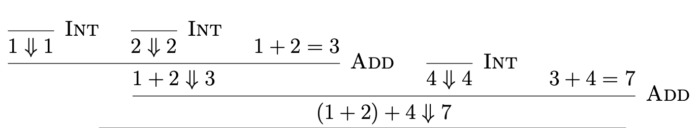

# Homework Assignment 3


**Due Tuesday, Feb 20th at 11:59PM (Pacific Time)**


## Overview

In this assignment, we will continue to augment $\lambda^+$. This time, we will add booleans, lists, and recursion.

This homework will consist of four parts. 
- The first part gives you lots of practice with the syntax and the operational semantics of the augmented $\lambda^+$ language.
- The second part is where you will implement the language extensions for the $\lambda^+$ interpreter.
- The third part is a small hacking exercise in which you will reverse-engineer the operational semantics for a brand new language extension.
- The fourth part (bonus) shows you how to use the same recipe from last HW to encode all kinds of fancy data structures into $\lambda$-calculus. 
  
The final part will culminate in a [self-interpreter](https://en.wikipedia.org/wiki/Meta-circular_evaluator) for $\lambda$-calculus.


## Instructions

0. Make sure you download the latest version of the reference manual [using this link](https://github.com/fredfeng/CS162/blob/master/homework/lamp.pdf).
1. Either clone this directory, or download the zipped directory using [this link](https://download-directory.github.io/?url=https%3A%2F%2Fgithub.com%2Ffredfeng%2FCS162%2Ftree%2Fmaster%2Fhomework%2Fhw3).
2. You will be modifying `lib/lamp/eval.ml`, and (for bonus) `lib/meta/encodings.txt` by replacing the placeholders denoted by `todo`, `hmm`, or `bonus` with your own code.
3. You must not change the type signatures of the original functions. Otherwise, your program will not compile. If you accidentally change the type signatures, you can refer to the corresponding `.mli` file to see what the expected type signatures are.
4. Once you're done, run `make`, which will create an archive called `submission.zip` containing `lib/lamp/eval.ml`, and (for bonus) `lib/meta/encodings.txt`. Submit the zip file to Gradescope. If your program contains print statements, please remove them before submitting. You do not need to submit any other file, including any `.mli` file or test code. The autograder will automatically compile your code together with our testing infrastructure and run the tests.


## Important Notes
* There will be 1 `📝` exercise that **will be graded**. Please do not forget to submit your solution to Gradescope. The remaining 📝 exercises are ungraded.
* Problems marked with `🧑‍💻` are programming tasks, and will be autograded on Gradescope. In solving those problems:
  * You are **not** allowed to use in built-in OCaml library functions in your solutions, except for `String.equal`, `^` (for string concatenation), and `Int.to_string` (to convert an `int` into a `string`). If you do, you will not be awarded any points. Note that language features like pattern-matching do not count as library functions. You may use library functions like `Fmt.pr` to test your code, but you must remove them before submitting.
  * You are **not** allowed to use any kind of imperative features, including mutable state (e.g. references and arrays), loops, etc. If you do, you will not be awarded any points.
* Problems marked with `⭐️bonus⭐️` are optional. You will receive extra credit by solving them. You will not be tested on them in the midterm.
* The actual programming problems were designed so that you won't need to write more than 100 lines of code in total, but they do require a solid grasp of the concepts covered in lectures and in sections.
* If you are struggling, please do not hesitate to ask questions in the `#hw3` Slack channel or come to office hours.


## Testing

We have provided one unit test for each programming problem. To run all unit tests, simply run 
```bash
dune runtest
```
in the root directory of this homework. This will compile your programs and report tests that fail.

We highly encourage you to add your own tests, since the autograder won't show you what the official test cases are (only the identifiers of passed/failed cases will be shown). You can locate the provided test cases in `test/test_lamp.ml`.


## Part 1: Language Extensions

### 1.1 Concrete Syntax

Let's augment $\lambda^+$ with booleans, lists, and the fixed-point operator (to express recursive definitions). Please see the [Overview](https://github.com/fredfeng/CS162/blob/master/homework/lamp.pdf) section of the language reference manual for an informal discussion of the meaning and the concrete syntax of those language extensions. The new syntactic forms should be quite similar to OCaml. 

Several things to note:
1. Recursive function definitions are de-sugared into a combination of `let`, `lambda`, and `fix`. For example, the following recursive definition
   ```ocaml
   fun rec fact with n = 
       if n = 0 then 1
       else n * fact (n-1) in
   fact 5
   ```
   will be de-sugared into
   ```ocaml
   let fact = fix fact is lambda n. 
       if n = 0 then 1
       else n * fact (n-1) in
   fact 5
   ```
   The de-sugaring procedure works as follows:
   1. First, we ignore the `rec` keyword, and de-sugar the function definition as if it were non-recursive into a combination of `let` and `lambda`. That is, we de-sugar
       ```ocaml
       fun fact with n = 
            if n = 0 then 1
            else n * fact (n-1)
       in ...
       ```
       into
       ```ocaml
       let fact = lambda n. if n = 0 then 1 else n * fact (n-1)
       in ...
       ```
   2. Then, we wrap the lambda function with `fix f is ...`. That is, we replace `lambda n. if n = 0 then 1 else n * fact (n-1)` with a wrapped version using `fix fact is ...`, which gives us
       ```ocaml
       let fact = fix fact is lambda n. if n = 0 then 1 else n * fact(n-1)
       in ...
        ```

2. Pattern-match on lists must end with the `end` keyword, unlike in OCaml.
3. You can only compare integers for equality. Boolean and list equality can easily be implemented with custom functions, so we don't include them as built-in features to make the core language as compact as possible.


### 1.2 Abstract Syntax

We will augment the AST of $\lambda^+$ as follows:
```ocaml
type expr =
  (* as before *)
  | ... 
  (* booleans *)
  | True
  | False
  | IfThenElse of expr * expr * expr
  | Comp of relop * expr * expr
  (* lists *)
  | Nil
  | Cons of expr * expr
  | Match of expr * expr * expr
  (* recursion *)
  | Fix of expr
```

- For booleans, 
  - `True` and `False` represent the boolean constants "true" and "false" respectively
  - `IfThenElse(e1, e2, e3)` represents the if-then-else expression `if e1 then e2 else e3`
  - `Comp(op, e1, e2)` represents the comparison `e1 op e2`, where `op` is a comparison operator. The comparison operators are `Eq`, `Lt`, and `Gt`.

- For lists, 
  - `Nil` represents the empty list
  - `Cons(e1, e2)` represents the cons cell `e1 :: e2`, i.e., making a new list whose head is `e1` and whose tail is `e2`
  - `Match(e1, e2, e3)` represents list pattern-matching as in `match e1 with Nil -> e2 | x::xs -> e3 end`. Note that the second branch of the match involves binding: the head of the list is bound to name "x" and the tail bound to "xs". Therefore, the third argument of the `Match` constructor will always be two nested `Scope` constructors. For example, the concrete syntax `match e1 with Nil -> e2 | x::xs -> e3 end` is represented as
    ```ocaml
    Match(e1, e2, Scope("x", Scope("xs", e3)))
    ```
    If the third argument does not have this form, then we say the AST is malformed. Examples of malformed `Match` includes:
    ```ocaml
    (* the cons branch isn't a scoped binding: *)
    Match(.., .., Num 1) 
    (* the cons branch only declares one variable: *)
    Match(.., .., Scope("x", Num 1))
    (* the nil branch shouldn't have binding: *)
    Match(.., Scope("x", Num 2), ...)
    ```
- For recursion, the `Fix` constructor represents the fixed-point operator. `Fix` also has a binding structure: it declares the name of the recursive function to be in-scope in the function definition. Thus, `Fix(Scope("f", ..))` is well-formed, while `Fix(Num 3)` is not.

**Problem (📝)**: Parse the following expressions in concrete syntax into ASTs:
1. `if if 3=10 then Nil else false then if true then lambda x.x else false else 1`
2. `1::(Nil::true)::lambda x.x`
3. `fun rec length with xs = match xs with Nil -> 0 | _::xs' -> 1 + length xs' end in length (1::2::3::Nil)`


**Problem (📝)**: Augment the `wf` function from last HW to check whether an expression is well-formed in terms of its binding structure:
```ocaml
let rec wf (vs: string list) (e: expr) : bool =
    match e with
    | ... (* as before *)
    | True -> (* todo *)
    | False -> (* todo *)
    | IfThenElse (e1, e2, e3) -> (* todo *)
    | Comp (op, e1, e2) -> (* todo *)
    | Nil -> (* todo *)
    | Cons (e1, e2) -> (* todo *)
    | Match (e1, e2, Scope (x, Scope (y, e3))) -> 
        (* todo *)
    | Match _ -> false
    | Fix (Scope (x, e)) -> (* todo *)
    | Fix _ -> false
```

### 1.3 Operational Semantics

**Problem (📝)** For the following expressions, determine whether it is a value or not:
1. `lambda x. x + 2 * y`
2. `x`
3. `(lambda x. x + 2 * y) 3`
4. `10 < 10`
5. `1::2::3+4::Nil`
6. `Nil::(Nil::lambda x.x)::true::1`
7. `if true then false else true`
8. `match Nil with Nil -> Nil | _::_ -> Nil end`


**Problem (📝)**: Formalize the is-value relation as a set of inference rules. The is-value relation determines whether an expression is a value, and is notated as `e val`. The following two rules are provided to you:
```
--------- (V-True)
true val

--------- (V-True)
false val
```

Your task is to add more rules to the above list to cover all values in $\lambda^+$ as defined by natural language in the [Operational Semantics](https://github.com/fredfeng/CS162/blob/master/homework/lamp.pdf) section of the language reference manual.

Your inference rules should be 
1. **complete**, meaning that if $e$ is indeed a value in $\lambda^+$, then the relation `e val` should be derivable using your rules.
2. **sound**, meaning that if the relation `e val` is derivable using your rules, then $e$ is indeed a value in $\lambda^+$.

And the is-value relation defined by your rules should satisfy the following property: `e val` if and only if $e \Downarrow e$.


**Problem (📝)** When we say $\exists v. e \Downarrow v$, we mean that there exists a value $v$ for which we can draw the derivation tree that shows $e \Downarrow v$ holds using the inference rules. What do we mean when we say $\neg\exists v. e \Downarrow v$? In which cases can we *not* draw the derivation tree?

*Hint*: There are at least two distinct cases.


**Problem (📝)** For the following expressions $e$, determine whether there exists a value $v$ such that $e \Downarrow v$. If such a value exists, draw the derivation tree. Otherwise, draw a partial derivation tree and clearly indicate which place(s) of the tree is stuck.
1. `(if 3>4 then 5 else 7+10*3) = 10`.
2. `let f = lambda x:Bool. if x then false else true in f (10 > 0)`
3. `1 :: 10 :: Nil :: Nil`
4. `(1::10) :: Nil :: Nil`
5. `match 1::Nil with Nil -> 0 | hd::_ -> hd end`
6. `match 1::Nil with Nil -> 0 | _::tl -> tl end`
7. `match 1::2 with Nil -> 3 | x::y -> x+y end`
8. `let g = fix recur is lambda n. if n < 1 then 1 else recur (n-1) + recur (n-2) in g 2`.
9.  `(fix recur is lambda xs. match xs with Nil -> 0 | _::ys -> 1 + recur ys end) (false::true::Nil)` (you might want to abbreviate the function body using some symbol in your derivation tree)
10. `(fix recur is lambda n. recur (n-1) 10`
11. `(fix recur is lambda n. n-1) 10`


### 1.4 What if ...?

Programming languages and their operational semantics are designed by humans. As such, the human designer will always face a load of design decisions that may lead to systems with different theoretical properties and practical trade-offs.


In this part, we will explore some of the "road not taken" in the design of $\lambda^+$, and explore their consequences. This will also help you gain a deeper understanding of why $\lambda^+$ is designed the way it is. Finally, similar questions may appear on the midterm, so it's good to get some practice.


**Problem (📝)**: $\lambda^+$ has the following `App` rule :
```
    e1 ↓↓ \lambda x.e1' 
    e2 ↓↓ v   
    e1'[x |-> v] ↓↓ v'
------------------------ (App)
    (e1 e2) ↓↓ v'
```
An alternative is to have the following `App` rule:
```
    e1 = \lambda x.e1' 
    e2 ↓↓ v   
    e1'[x |-> v] ↓↓ v'
------------------------ (App-Alt1)
    (e1 e2) ↓↓ v'
```
where we simply changed the first premise to an equation instead of an evaluation relation.

Let us denote the original evaluation relation as $\Downarrow$ and the alternative evaluation relation in which `App` is replaced by `App-Alt1` as $\Downarrow_1$.

Exhibit an expression $e$ such that $\exists v.\ e \Downarrow v$ but $\neg\exists v.\ e \Downarrow_1 v$, i.e., the evaluation of $e$ works fine with the original rule but gets stuck/doesn't terminate with the alternative rule.

*Hint*: Consider the application of "multi-argument" functions.


**Problem (📝)**: Another alternative to the `App` rule is to have the following rule:
```
    e1 ↓↓ \lambda x.e1'   
    e1'[x |-> e2] ↓↓ v
-------------------------- (App-Alt2)
    (e1 e2) ↓↓ v
```

Let us denote the original evaluation relation as $\Downarrow$ and the alternative evaluation relation in which `App` is replaced by `App-Alt2` as $\Downarrow_2$.

Exhibit an expression $e$ such that $\neg\exists v.\ e \Downarrow v$ but $\exists v.\ e \Downarrow_2 v$, i.e., the evaluation of $e$ gets stuck/doesn't terminate with the original rule but works fine with the alternative rule.

*Hint*: What is call-by-value, and what is call-by-name? (You've seen these concepts in lectures.)


**Problem (📝)**: The *size* of a derivation tree can be computed simply by counting the total number of rules used. Note that multiplicities are counted, i.e., if the same rule is used N times, then it contributes N to the total size of the derivation tree. For example, the following tree has size 5:



Exhibit an expression $e$ such that $e$ evaluates to some value $v$ using both $\Downarrow$ and $\Downarrow_2$, but the size of the derivation tree for $e \Downarrow v$ is strictly smaller than the size of the derivation tree for $e \Downarrow_2 v$.

In practical terms, this means that any interpreter that implements $\Downarrow_2$ will take longer to evaluate $e$ than an interpreter that implements $\Downarrow$.


**Problem (📝)**: Let's consider the rule for evaluating let-expressions:

```
    e1 ↓↓ v1
    e2[x |-> v1] ↓↓ v2
--------------------------- (Let)
    let x = e1 in e2 ↓↓ v2
```

and the alternative
```
    e2[x |-> e1] ↓↓ v2
--------------------------- (Let-Alt)
    let x = e1 in e2 ↓↓ v2
```


Let us denote the original evaluation relation as $\Downarrow$ and the alternative evaluation relation in which `Let` is replaced by `Let-Alt` as $\Downarrow_1$.

1. Does there exists an expression $e$ such that $\exists v.\ e \Downarrow v$ but $\neg\exists v.\ e \Downarrow_1 v$? If so, find one, and draw the derivation tree for $e \Downarrow v$. Then draw the partial derivation tree for $e \Downarrow_1 v$ and clearly indicate where it gets stuck/gets into infinite loop.

2. Does there exists an expression $e$ such that $\neg\exists v.\ e \Downarrow v$ but $\exists v.\ e \Downarrow_1 v$? If so, find one, and draw the derivation tree for $e \Downarrow v$. Then draw the partial derivation tree for $e \Downarrow_1 v$ and clearly indicate where it gets stuck/gets into infinite loop.

3. Exhibit an expression $e$ such that $e$ evaluates to some value $v$ using both $\Downarrow$ and $\Downarrow_1$, but the size of the derivation tree for $e \Downarrow v$ is strictly smaller than the size of the derivation tree for $e \Downarrow_1 v$.


**Problem (📝)**: Recall the list-cons rule:

```
    e1 ↓↓ v1
    e2 ↓↓ v2
------------------------ (Cons)
    e1::e2 ↓↓ v1::v2
```
and consider the alternative
```
------------------------ (Cons-Alt)
    e1::e2 ↓↓ e1::e2
```

Then, recall the cons case of the list-match rule:
```
    e1 ↓↓ v1::v2
    e3[x |-> v1][y |-> v2] ↓↓ v3
------------------------ (MatchCons)
    match e1 with 
    | Nil -> e2 
    | x::y -> e3 
    end
    ↓↓ v3
```

Your task is to design a new rule `MatchCons-Alt` that replaces `MatchCons` while also being compatible with `Cons-Alt`:
```
    ??
    ??
------------------------ (MatchCons-Alt)
    match e1 with 
    | Nil -> e2 
    | x::y -> e3 
    end
    ↓↓ v3
```

Let us denote the original evaluation relation as $\Downarrow$ and the alternative evaluation relation as $\Downarrow_1$ in which `Cons` and `MatchCons` are replaced by `Cons-Alt` and `MatchCons-Alt`.

By compatible, we mean that if $e \Downarrow v$ using the original rules, then we should also have $e \Downarrow_1 v$ using the alternative rules. That is, for any expression $e$, the new rules should behave the same as the old rules if the old rules indeed evaluates $e$ to some value $v$, although the new rules can be more permissive, i.e., $e$ may get stuck with the old rules but works fine with the alternative rules.


**Problem (📝)**: Consider $\Downarrow_1$ which you just defined. Update your rules for the "is-value" relation, such that $v$ is a value according to the updated rules if and only if $v \Downarrow_1 v$.


## Part 2. Augmenting the Interpreter


**Problem (🧑‍💻, 40 points)** Augment the interpreter you wrote for HW2 with support of booleans, lists, and recursion according to the operational semantics specified in the [language reference manual](https://github.com/fredfeng/CS162/blob/master/homework/lamp.pdf). Specifically, for the `free_vars`, `subst` and `eval` functions:
- Copy and paste the code you wrote in the previous assignment for `free_vars`, `subst` and `eval` into `lib/lamp/eval.ml`.
- Fill in `todo ()` with fresh code. *Hint*: the new cases of `free_vars` and `subst` should be trivial; you shouldn't need to modify `Var` or `Scope`.
- Ignore `hmm ()` for this problem.

There are two ways to test your interpreter:

1. We included some unit tests as well as a couple of realistic $\lambda^+$ programs in [test/examples/](./test/examples/) that you can use to test your interpreter. Simply run `dune runtest`.

2. You can also run the interpreter interactively (REPL) or in file mode as described in the previous assignments. For file mode, do `dune exec bin/repl.exe -- <filename>`. For REPL, simply run the following command:
   ```bash
   dune exec bin/repl.exe
   ```

   We added some convenience commands to the REPL:
   - `<expr>` triggers your interpreter to evaluate the expression, as usual.
   - CTRL-C interrupts the REPL and initiate a new prompt. This is useful if your interpreter enters an infinite loop, or you simply want to throw away the current input expression and start anew.
   - CTRL-D quits the REPL.
   - `#let <var> = <expr>` evaluates the right-hand-side expression and adds the binding to the environment. Subsequent expressions can refer to this binding. For example
       ```
       > #let x = 10
       x = 10

       > x + 1
       <== x + 1
       [eval] ==> 11

       > #let x = 20
       x = 20

       > x + 1
       <== x + 1
       [eval] ==> 21
       ```
      Note that 
        1. This syntax is only available in the REPL mode. Do not confuse it with `let`-expressions in the language itself, which you implemented in HW2.
        2. Later bindings may shadow earlier ones, just like in OCaml.
   - `#print` shows the current binding environment.
   - `#clear` resets the binding environment.
   - `#save <filename>` saves the current history of commands to a file
   - `#load <filename>` loads a file containing a list of commands and replays them. Binding commands are also replayed, so you can create a file that contains a sequence of `#let` commands and replay them to set up a particular environment. You can load multiple files by doing multiple `#load` commands.

## Part 3. Semantics Reverse-Engineering

In CS162, we are model citizens who always define the meaning of each language feature precisely using operational semantics rule first, before we proceed to make claims about the language. In this way, we are highly confident that we know exactly what we mean when we express something using this language, and we know for sure we aren't planting time bombs with our code.

Unfortunately, this style of carefully specifying language semantics is an exception instead of the norm in the real world. Here are some common ways people define a language, ranked by increasing likelihood of imminent disaster:

1. Define a language by providing a canonical **interpreter**: If we wonder what a language feature means, we need to construct an example program containing said feature, and observe the behavior of the program on the official interpreter. Of course, the interpreter itself is written in some other programming language (so the meaning of the target language fundamentally depends on the meaning of the implementation language, which by itself also needs a definition). Examples include Python, Ruby, and JavaScript.

2. Define a language by providing a canonical **compiler**: If we wonder what a language feature means, we need to construct an example program containing said feature, and run the official compiler on the program to get a **low-level program** (such as assembly). Then, based on (i) our understanding of the semantics of the low-level language or (ii) the runtime side effect of the low-level program, we infer the meaning of the high-level program. Examples include C, C++, and Rust.

3. Define a language by natural language. No examples are needed here, and no more shall be said about this forbidden dark art. May the gods have mercy on the souls of those who have to maintain such languages.

In this part of the homework, you will get some practice with the first approach. That is, you will be inferring the meaning of a new $\lambda^+$ language extension from a reference interpreter provided to you. However, to bring good to the world, you will also formalize your understanding of the meaning of this language feature into operational semantics rules.


### Products

The language extension we are considering is products (aka pairs, tuples, etc.). We introduce one syntactic form that introduces / makes / constructs a product from two elements: `{ e1, e2 }`, and two syntactic forms that eliminates / uses / destructs a product: `fst e` and `snd e`. In the AST, the introduction form is represented as `Pair of expr * expr`, and the elimination forms are represented as `Fst of expr` and `Snd of expr`. None of those constructors have any binding structure.

The reference interpreter on CSIL (located at `~junrui/lamp`) implements products. Your task is to reverse-engineer their operational semantics by experimenting with different example expressions and observing the behavior of the interpreter. Finally, you will formalize your understanding of the semantics of products into a set of inference rules.

---
**Problem (📝, GRADED, 10 points)**: Augment the operational semantics of $\lambda^+$ with rules for products. You should define three rules: one for the introduction form, and one for each of the two elimination forms. You should name the first rule `E-Pair`, and the second and third rules `E-Fst` and `E-Snd` respectively.

For each rule, you should also include 1-2 sentences to informally explain what your rules are doing. 

In addition, you should ensure that the augmented set of rules is

1. **complete**, meaning that if the reference interpreter evaluates $e$ to $v$, then the relation $e \Downarrow v$ should be derivable using your rules.
2. **sound**, meaning that if the relation $e \Downarrow v$ is derivable using your rules, then the reference interpreter should evaluate $e$ to $v$.

Note that the above two conditions imply that derivation using your rules should get stuck if and only if the reference interpreter gets stuck.

You can either typeset your solution using LaTeX's `ebproof` package (**recommended**), or hand-write your rules on a piece of paper and take a picture. You can find a LaTeX template for this part of the homework in [template.tex](./template.tex). If you take the hand-write route, you must make sure that the writing is clean and legible for the TAs to read.

Once you're done, submit your rules to the Gradescope assignment called "HW3 (Part 3 Written Problem)".

As an example of using LaTeX's `ebproof` package, the following derivation:


can be typeset with
```latex
\usepackage{ebproof}

...

\begin{prooftree}
    \infer0[\textsc{Int}]{1 \Downarrow 1}
    \infer0[\textsc{Int}]{2 \Downarrow 2}
    \hypo{1+2 = 3}
    \infer3[\textsc{Add}]{1 + 2 \Downarrow 3}
    \infer0[\textsc{Int}]{4 \Downarrow 4}
    \hypo{3+4 = 7}
    \infer3[\textsc{Add}]{(1 + 2) + 4 \Downarrow 7}
\end{prooftree}
```
where `infer<n>` denotes the usage of a rule with `n` hypotheses, and `hypo` is a statement with no bar line above it.


Once you're satisfied with your rules, you can optionally implement the `Pair`, `Fst`, and `Snd` cases of the `eval` function, although none of the autograder tests involve those cases.


## Part 4. Encoding Recursive Data Structures into $\lambda$-calculus

> This part is completely optional.
>
> Total: 4 ⭐️bonus⭐️ points

In the previous homework, we have seen how to encode booleans and options into $\lambda$-calculus. We followed a recipe that goes like this:
1. We observed that any data structure has two aspects that are dual to each other: the introduction form (i.e. constructors) and the elimination form (i.e. pattern matching).
2. We observed that encoding the introduction form of a type into $\lambda$-calculus was hard, so we started from the elimination form instead.
3. We wrote down a function that does the same thing as the elimination form. For example, the elimination form for boolean is 
   ```ocaml
   if b 
   then do something
   else do something
   ```
   which we translated into an OCaml function as
   ```ocaml
   let elim_bool (b: bool) (true_case: 'result) (false_case: 'result) : 'result = 
       if b then true_case else false_case
   ```
4. We inspected the type of the elimination form, which for type `t` would look like
    ```ocaml
    val elim_t : t -> ...
    ```
    Since we wanted to encode `t`, we simply *defined* the encoding of `t` to be whatever type is on the right-hand-side of the arrow.
    
    For example, the type of `elim_bool` was
    ```ocaml
    bool -> 'result -> 'result -> 'result
    ```
    so we defined the encoding of `bool` to be functions of type `'result -> 'result -> 'result`, i.e., functions that, given what to do in the `then` case and what to do in the `else` case, picks one of them depending on which branch is taken.
5. We then derived the introduction forms from the elimination form by feeding the constructors into the elimination function. For example, we derived `true_encoding` by considering `elim_bool true`, which had the same behavior as
   ```ocaml
    let true_encoding (true_case: 'result) (false_case: 'result) : 'result = 
         true_case
   ```
6. Finally, we translated those OCaml functions into $\lambda$-calculus.
    

This time, we'll use the same recipe to derive the $\lambda$-calculus encoding of fancier data structures, like singly linked-lists, binary trees, and the AST of $\lambda$-calculus itself. But we will start with something humbler: natural numbers, which, as we shall see very soon, distills the "essence" of lists, trees, and basically any recursive data structure you can think of.


### 4.1 Encoding Natural Numbers

Again, we will do some experiments in OCaml before we move on to $\lambda$-calculus. Natural numbers can be defined in OCaml as
```ocaml
type nat = Zero | Succ of nat
```
which specifies its introduction forms as `Zero` and `Succ`. The `Succ` constructor takes a natural number $n$ as its argument, and gives us back $n+1$. For example, the number $3$ is represented as `Succ (Succ (Succ Zero))`.

According to our recipe, the first step is to identify the elimination form of `nat`, which seems to be
```ocaml
match n with
| Zero -> do something
| Succ n' -> do something else with n' in mind
```
which is largely the same as the elimination form for options.

This pattern-match be easily translated into the following OCaml function:
```ocaml
let elim_nat_nonrec (n: nat) (base_case: 'result) (succ_case: nat -> 'result) : 'result = 
    match n with
    | Zero -> base_case
    | Succ n' -> succ_case n'
```


Intuitively, however, `nat` seems to be more complicated than `option`: the only thing we can do with `option` is to pattern-match on it and see if it's `None` or `Some`. But with `nat`, we can do *much* more: we can also do **recursion**! For example, here's the addition function for natural numbers:
```ocaml
let rec add (n: nat) (m: nat) : nat = 
    match n with
    | Zero -> m
    | Succ n' -> Succ (add n' m)
```
Unfortunately, we cannot use `elim_nat_nonrec` to rewrite `add`: we also need recursion to do it!

In a previous part of the assignment, you have implemented *general recursion* using the fixed-point operator `fix`. However, generality also came at a tremendous cost: `fix` can be used to express any kind of recursion, including non-terminating ones! For example, `fix f is f` is an expression that will never terminate.

In some sense, `fix` is *too* powerful. In addition to allowing us to express good old terminating recursion, it also opens the door to all kinds of evil non-terminating recursion. 99% of the time, however, we just need a way to express terminating recursion. For example, just by *looking at the syntax* of the `add` function, we know for sure it terminates: it always decreases the first argument `n` in the recursive call. Since any `nat` can only have finitely many `Succ` constructors, the recursion must terminate.

Thus, it would be nice if our elimination form for `nat` encodes all terminating recursive functions into $\lambda$-calculus, which should allow us to express 99% of what we want to do with `nat`. If the user really, really, really wants to express non-terminating recursion, they can always use `fix` in case they are so desperate.

> **Background note**: This exemplifies a good language design principle: instead of allowing the programmer to do anything they want at anytime, the language itself should only expose a set of *safe* constructs that are guaranteed to well-behaved while also being sufficient for most use cases. If the programmer *really* wants to do something that can't be expressed using the safe interface, the language may provide a "jail-break" mechanism that allows the programmer to temporarily disable the protection. 
> 
> The mutual contract is that, if the programmer decides to jail-break and ends up wreaking havoc, it's their own fault. But if they use the safe interface and still wreak havoc, it's the language designer's fault.
> 
> Examples of this principle include [the `unsafe` keyword in Rust](https://doc.rust-lang.org/book/ch19-01-unsafe-rust.html) which allows the programmer to temporarily break memory safety. Contrast this with C, which allows the programmer to break memory safety (e.g., do pointer arithmetic) at any time and thus no assurances can be made about the safety of C programs whatsoever ¯\\\_(ツ)\_/¯


### 4.2 Primitive Recursion

Our revised goal is thus: we would like an elimination form for `nat` that permits safe, terminating recursion, which is sufficient for most use cases. Then, we will encode this elimination form into $\lambda$-calculus.


Actually, we claim that you already know how to guarantee a recursion on natural numbers always terminate... when you do *induction*! If our inductive proofs didn't "terminate", then we would not be proving anything at all! We will use this observation to derive the elimination form for `nat`.

The structure of an inductive proof on some statement $P(n)$ is as follows:
- We show that $P(0)$ holds
- Assuming we have a proof of $P(n-1)$, we use this proof to make a new proof that shows $P(n)$ holds.

Note that this is the same structure of (bottom-up) divide-and-conquer algorithms:
- We first compute the base case $f(0)$
- Assume we have a solution to the sub-problem of size $n-1$. That is, assume we get our hands on what $f(n-1)$ should be. We then use $f(n-1)$ to make a solution to the original problem of size $n$, which is $f(n)$.

It is actually not too difficult to update our previous `elim_nat` to handle this pattern! Recall that we had
```ocaml
let elim_nat_nonrec 
    (n: nat) 
    (base_case: 'result) 
    (succ_case: nat -> 'result)
    : 'result = 

    match n with
    | Zero -> base_case
    | Succ n' -> succ_case n'
```
The only missing piece is that, in the `Succ` case, the function `succ_case` only had access to the number $n-1$ in order to compute the result of $f(n)$. However, the induction/recursion principle suggests that we can strengthen it to give the result of recursively computed $f(n-1)$, aka the inductive hypothesis! So our new `elim_nat` will look like
```ocaml
let elim_nat
    (n: nat) 
    (base_case: 'result) 
    (ind_case: nat -> 'result -> 'result) 
    : 'result = ...
```
where we simply renamed `succ_case` to `ind_case`, and added a new `result` parameter to represent the recursive result/inductive hypothesis.

All it remains is to provide a definition of `elim_nat`. As before, we call `base_case` when the input nat is `Zero`, and call `ind_case n'` when the input is `Succ n'`:
```ocaml
let rec elim_nat 
    (n: nat) 
    (base_case: 'result) 
    (ind_case: nat -> 'result -> 'result) 
    : 'result =

    match n with
    | Zero -> base_case
    | Succ n' -> 
        let result = _? in
        ind_case n' result
```
The only missing puzzle piece is: `ind_case` now takes one more argument, which is the result of recursively computing $f(n-1)$. How do we compute that? Well, we just recursively compute it... by calling `elim_nat` on $n-1$! (Note that $n-1$ is called `n'` in the code snippet above, since `n = Succ n'`.) So we have
```ocaml
    ...
    | Succ n' -> 
        let result = elim_nat n' base_case ind_case in
        ind_case n' result
```
There we go! We have derived the elimination form for natural numbers that can express any terminating recursion on natural numbers. 


> **Background note**: The `elim_nat` function that we just derived often goes by the name **primitive recursion**, which was also featured prominently in Gödel's incompleteness theorems!


### 4.3 Expressiveness of Primitive Recursion


We claim that primitive recursion for natural numbers is powerful enough to express 99% of the functions on natural numbers that we care about. First, let's see how we can reimplement `add` using `elim_nat`. 

Let's recall our previous implementation:

```ocaml
let rec add (n: nat) (m: nat) : nat = 
    match n with
    | Zero -> m
    | Succ n' -> Succ (add n' m)
```

To make it more obvious how to rewrite it using `elim_nat`, let's first name the recursive result using a variable `result`:
```ocaml
let rec add (n: nat) (m: nat) : nat = 
    match n with
    | Zero -> m
    | Succ n' -> 
        let result = add n' m in
        Succ result
```

Then, let's recall our `elim_nat`:
```ocaml
let rec elim_nat 
    (n: nat) 
    (base_case: 'result) 
    (ind_case: nat -> 'result -> 'result) 
    : 'result =

    match n with
    | Zero -> base_case
    | Succ n' -> 
        let result = elim_nat n' base_case ind_case in
        ind_case n' result
```

If we literally do a `diff` on those two functions, we can see that:
- `base_case` becomes `m`. Thus, if we redefine `add` using `elim_nat`, the base case will simply be `m`.
- `ind_case n' result` result becomes `Succ result`. Thus, if we redefine `add` using `elim_nat`, the inductive case will be a function that, given the predecessor n' and the recursive result, simply returns `Succ result` (and ignores the predecessor).
- Although the two functions also differ at `let result = add n' m in` vs `let result = elim_nat n' base_case ind_case in`, we don't have to worry about this, as this is a recursive call on a smaller problem, and `elim_nat` will faithfully pass the same `base_case` and `ind_case` to the recursive call, so the recursive call will behave correctly.

Thus, we can rewrite `add` as:
```ocaml
let add_encoding (n: nat) (m: nat) : nat = 
    elim_nat n 
        m
        (fun _ result -> Succ result)
```

Note that this `add_encoding` is no longer recursive! All the recursion has been hidden inside `elim_nat`.

**Problem (📝)**:
1. Define `mul: nat -> nat -> nat` and `factorial: nat -> nat` using pattern-match and recursion (i.e., don't use `elim_nat` yet). You may use `add` in your definition of `mul`, and `mul` in your definition of `factorial`.
2. Derive `mul_encoding` and `exp_encoding` which use `elim_nat` from your `mul` and `factorial`.

---

To recap, let's review the type of `elim_nat`, which is
```ocaml
val elim_nat : 
    nat -> 
    'result -> 
    (nat -> 'result -> 'result) -> 
    'result
```
We know that
- `elim_nat` first takes a `nat`, which is the natural number we want to eliminate -- i.e., the number we want to do recursion/induction on.
- it then takes a `base_case`, which tells us what to do in the `Zero` case. This might be a value of an arbitrary type `'result`
- it finally takes a `ind_case` with type `nat -> 'result -> 'result`. This corresponds to the inductive step in an inductive proof, or the recursive step in a divide-and-conquer algorithm. That is, this step
  - takes a `nat` which records the size of the "smaller problem" which is equal to the predecessor of the current problem size, and
  - the solution to the "smaller problem", which might be a value of an arbitrary type `'result`,
  - and it computes the solution to the bigger problem, which is also a value of type `'result`
- it finally returns a value of type `'result`, which is the overall result of the recursion/induction.

Armed with this powerful elimination function, we can now follow the same recipe to encode natural numbers into $\lambda$-calculus **by identifying natural numbers with their elimination form**. We'll do the same thing as we did for booleans, by moving `nat` from the argument list in to the left-hand-side of an equation, and renaming it into `nat_encoding`:
```ocaml
nat_encoding = 
    'result -> 
    (nat_encoding -> 'result -> 'result) -> 
    'result
```
That is, we declare that natural numbers in $\lambda$-calculus are exactly functions of the above type: a `nat` is encoded as a function that, given
- what to do in the zero case, which has type `'result`
- what to do in the successor case, which takes the predecessor (of type `nat_encoding`) and the inductive result, and computes one more step of recursion

gives you back the overall result of recursion.

> **Side note**: You may feel uneasy about that fact that there's still a left-over `nat_encoding` in `'result -> (nat_encoding -> 'result -> 'result) -> 'result`: our type definition seems to be cyclic. But natural numbers in some sense have to be cyclic: every non-zero number contains a smaller number inside it. Intuitively, this cyclicity was inherent in our original definition of `nat`, so it must somehow show up in `nat_encoding` as well. 
> 
> However, this cyclicity is fine because our $\lambda$-calculus doesn't have a type system (yet), so this `nat_encoding` type is just there to help us understand what the encoding will do. Types are irrelevant from the perspective of evaluation, so we can ignore them when translating natural numbers into $\lambda$-calculus. However, the issue of assigning types to encodings of recursive data structures is a very interesting topic in the theory of programming languages, and we will revisit this issue towards the end of this quarter when we talk about type systems and polymorphism.

---
**Problem (📝)**: 
Given that we have found the elimination form for natural numbers, we should be able to automatically derive the usual introduction forms as functions!

1. Define `zero_encoding` as an OCaml function of type `'result -> (nat -> 'result -> 'result) -> 'result`. *Hint*: Don't think; just derive its definition by considering `elim_nat Zero`. 
2. Define `succ_encoding` as an OCaml function of type `nat -> 'result -> (nat -> 'result -> 'result) -> 'result`. *Hint*: Don't think; just derive its definition by considering `elim_nat (Succ n)`.

---

**Problem (⭐️bonus⭐️, 0.5 points)**:
Translate `zero_encoding` and `succ_encoding` from OCaml to $\lambda^+$. 

*Hint*: for `succ_encoding`, remember that any occurrence of `elim_nat n <args>` in OCaml simply becomes `n <args>` in $\lambda^+$, since an encoded natural number is, by definition, its elimination form!

Provide your solutions in [lib/meta/encodings.txt](./lib/meta/encodings.txt). Specifically, locate the bindings `#let zero = bonus` and `#let succ = bonus`, and replace `bonus` with concrete $\lambda^+$ expressions. 

There are two ways to test your solution.

1. The test file [test/test_meta.ml](./test/test_meta.ml) defines a list called `nat_tests` which has some unit tests. Please feel free to add more.

2. You can also verify your solution in $\lambda^+$ using your own interpreter or the reference interpreter on CSIL. It might be hard to tell which natural number is encoded by a lambda expression. To remedy this, we have provided a decoder function in [lib/meta/encodings.txt](./lib/meta/encodings.txt) to convert an encoded nat into a native integer in $\lambda^+$. For example, if you're using the REPL:
   ```ocaml
   > #load lib/meta/encodings.txt

   > dec_nat (succ (succ (zero))) // should evaluate to 2
   ```


---


**Problem (⭐️bonus⭐️, 0.5 points)**:
Using this encoding scheme of natural numbers, implement the following functions:
- addition
- multiplication
- factorial

Provide your solution in `lib/meta/encodings.txt`. You may find it helpful to first define those functions in OCaml using `elim_nat`, and then translate them into $\lambda^+$.

Feel free to add unit tests in `test/test_meta.ml`. You can also verify your solution in $\lambda^+$ using your own interpreter or the reference interpreter on CSIL.

Finally, compare your encodings of `zero`, `succ`, and `add` with the ones shown in lectures. They will be slightly different. Where do they differ? Why do you think they differ? Think about this for a second; we'll examine this question in the first appendix.


---

**Problem (⭐️bonus⭐️, 0.5 points)**:
In lectures, we didn't talk about subtraction or comparison of natural numbers. Let's do them here. In [lib/meta/encodings.txt](./lib/meta/encodings.txt), define the following functions using our encoding of natural numbers:
- `pred` which computes the predecessor of a natural number. If the input is zero, simply return zero.
- `sub` which computes the difference of two natural numbers. If the first number is smaller than the second, simply return zero.
- `leq` which determines whether the first number is less than or equal to the second number. Return a Church-encoded booleans (which you wrote in HW2) instead of native booleans. You can simply refer to `tt` and `ff`, and those have been previously defined in the `encodings` list.
- `eq` which determines whether the first number is equal to the second number. Use Church booleans.

You may find it helpful to first define those functions in OCaml using `elim_nat`, and then translate them into $\lambda^+$.


### 4.4 Encoding Lists

The same recipe can be used to derive the $\lambda$-calculus encoding of `list`, which is defined in OCaml as
```ocaml
type 'a list = Nil | Cons of 'a * 'a list
```

**Problem (📝)**:
1. In OCaml, define `elim_list` in a way similar to how we defined `elim_nat`. The function should takes two arguments: what to do in the `Nil` case, and what to do in the `Cons` case. The `Cons` case should take as arguments the current head, the current tail, and the recursive reuslt. Your `elim_list` should have type
    ```ocaml
    'a list -> 'result -> ('a -> 'a list -> 'result -> 'result) -> 'result
    ```
    and it should be powerful enough to express all structurally terminating recursion on lists. 
2. Compare your `elim_list` with the `solve` function from HW2. What is the difference? Which one is more expressive?[^solve]
3. Define the following functions using `elim_list`. You may not use `rec` in your definition of these functions, or any pattern matching on lists.
   - `length: 'a list -> nat`
   - `reverse: 'a list -> 'a list`
   - `concat: 'a list -> 'a list -> 'a list`.

4. Starting from the type of `elim_list`, write down `list_encoding`, type of functions that encode lists, like what we did for natural numbers and `nat_encoding`. Then, derive `nil_encoding` and `cons_encoding` from `elim_list` in OCaml.

---

**Problem (⭐️bonus⭐️, 0.5 points)**: 
Define the following functions in $\lambda^+$:

1. Implement the encoding of `Nil` and that of the `Cons` constructor.

   We have provided a function called `dec_list` that converts an encoded list to a native list:
   ```ocaml
    (dec_list (cons 1 (cons 2 (cons 3 nil ))))
   ```
   The above program constructs the encoding of the list containing 1, 2, and 3, and then calls `dec_list` to convert it into the native list `1::2::3::Nil`. You can find the definition of `dec_list` in `encodings.txt`.

2. Implement a function `length` that computes the length of encoded lists, without using `fix` or `rec`. Your function should return encoded natural numbers, instead of native integers.

Provide your solutions in [lib/meta/encodings.txt](./lib/meta/encodings.txt). The test file `test/test_meta.ml` contains some unit tests. Feel free to add more. 


[^solve:] People usually call the `solve` function from HW2 `fold_right`, and they sometimes claim that `fold_right` is the most general recursive function on lists. So, next time when you're walking in the street and hear people making such claims, you can now show them that your `elim_list` is strictly more powerful than their `fold_right`, by challenging them to a duel of defining the `tail` function on lists using `elim_list` vs using `fold_right` :)


### 4.5 Encoding Binary Trees

Again, we can apply same recipe to derive the $\lambda$-calculus encoding of binary trees, which can be defined in OCaml as
```ocaml
type 'a tree = 
             | Leaf
             | Node of 'a * 'a tree * 'a tree
```

**Problem (📝)**:
1. In OCaml, define `elim_tree` in a way similar to how we defined `elim_nat`. The function should takes two arguments: what to do in the `Leaf` case, and what to do in the `Node` case. Your `elim_tree` should have type
    ```ocaml
    'a tree ->
    'result -> 
    ('a -> 'a tree -> 'a tree -> 'result -> 'result -> 'result) ->
    'result
    ```
    and it should be powerful enough to express all structurally terminating recursion on binary trees. 

1. What is the type of your `elim_tree`?
2. Define the following functions using `elim_tree`. You may not use `rec` in your definition of these functions, or any pattern matching on trees.
   - `size: 'a tree -> nat` that will count the number of nodes in the tree. Both a `Leaf` and a `Node` contribute one to the size.
   - `mirror: 'a tree -> 'a tree` that will return the mirror image of the input tree.
   - `equal: int tree -> int tree -> bool` which will determine if two trees are equal.
3. Starting from the type of `elim_tree`, write down `tree_encoding`, type of functions that encode trees, like what we did for natural numbers and lists. Then, derive `leaf_encoding` and `node_encoding` from `elim_tree` in OCaml.


---
**Problem (⭐️bonus⭐️, 0.5 point)**:
In $\lambda^+$:
1. Implement the encoding of `Leaf` and that of the `Node` constructor.
2. Implement a function `size` that computes the size of encoded binary trees, without using `fix` or `rec`. Your function should return encoded natural numbers, instead of native integers.

Provide your solutions in [lib/meta/encodings.txt](./lib/meta/encodings.txt). We have provided a `dec_tree` function in the same file that converts an encoded binary tree to a native list: leaves are mapped to `Nil`, and a node with value `v`, left subtree `l`, and right subtree `r` is mapped to the list `v::(l::r)`.

The test file `test/test_meta.ml` has a list called `tree_tests` which contains some unit tests. Feel free to add more.


### 4.6 A Self-Interpreter for $\lambda$-Calculus


This is it. This is the grand finale we have been building towards for the last two assignments: We will encode the ASTs of $\lambda$-calculus into $\lambda$-calculus itself. We will write a $\lambda$-calculus interpreter in $\lambda$-calculus itself. This interpreter will be called a *self-interpreter*, or a [*meta-circular interpreter*](https://en.wikipedia.org/wiki/Meta-circular_evaluator).

> 
> 
> *A depiction of the ouroboros, a snake eating its own tail.*


Before embarking on this journey, let's unpack what the word "meta" in "meta-circular" means by making a crucial distinction between the two levels of languages we've been dealing with.

- First, there's the **object language**, which is the language whose semantics we wish to define, i.e., we want to write an `eval` function for it.
- Second, there's the **meta language**, which is the language in which the interpreter is implemented.

Our object language has been $\lambda$-calculus. Our meta language has been OCaml (and also, the language of inference rules). And OCaml itself can be viewed as an object language, whose interpreter is built in some other meta language, and so on. You can build this tower of languages as high as you want.


However, we won't build the tower upward. Instead, we will have the snake eat its own tail:
```
object language = $\lambda$-calculus
meta language = $\lambda$-calculus
```

Of course, $\lambda$-calculus cannot manipulate itself directly.[^intro] What $\lambda$-calculus *can* do, however, is to manipulate *encodings* of $\lambda$-calculus if those encodings are lambda functions.

[^intro]: To do that we would need the superpower of [introspection](https://en.wikipedia.org/wiki/Type_introspection).

Thus, our plan is:
1. Encode the ASTs of $\lambda$-calculus as lambda functions, just like we did for booleans, options, natural numbers, lists, and trees.
2. Write an `eval` function in $\lambda$-calculus. The `eval` function will take the *encoding* of expression, and output the *encoding* of the result of evaluating the expression.

Since we'll be talking about the encoding of expressions a lot, let's define a concise notation for it:

> If $e$ is an arbitrary $\lambda$-calculus expression, let's use $\lceil e \rceil$ to denote the encoding of $e$. The function $\lceil \cdot \rceil$ will be called the *encoding function*.


#### Encoding $\lambda$-Calculus ASTs

We'll use our battle-tested recipe to encode $\lambda$-calculus ASTs:

1. Model the ASTs as an OCaml data type.
2. Write down the elimination form for this type as an OCaml function.
3. Equate the ASTs with their elimination form.
4. Derive the usual introduction forms from the elimination form.
5. Translate the introduction forms into $\lambda$-calculus.

Let's come up with a model of the AST of $\lambda$-calculus. We could (but won't) use `expr`, which models the ASTs of $\lambda^+$ expressions. However, we know -- by our previous encodings of natural numbers, booleans, and lists -- that removing those features from the our language do not change the expressive power of our language. So to keep things simple, we will model the core $\lambda$-calculus involving only variables, abstractions, and applications:

```ocaml
type ast = 
  | Var of int
  | Lambda of int * ast
  | App of ast * ast
```
We use `int` to represent variables, since $\lambda^+$ can't manipulate strings natively.

For example, the $\lambda$-calculus term $\lambda x. \lambda y. y\ x$ can be represented as
```ocaml
Lambda(0, Lambda(1, App(Var 1, Var 0)))
```

Now that we have a data type which specifies the introduction forms of `ast`, let's look at its elimination form. Previously, we had several alternatives for the elimination form, depending on whether we wanted to support recursion or not. Here, we'll just use the simplest, non-recursive elimination form -- pattern-matching -- for reasons that will become clear later. Given any `ast`, we can pattern match on it to see if it's a `Var`, `Lambda`, or `App`. Thus, we have
```ocaml
match a with
| Var i -> do something with int i in mind
| Lambda(i, body) -> do something with int i and ast body in mind
| App(e1, e2) -> do something with ast e1 and ast e2 in mind
```
which can be packaged into a function `elim_ast`:
```ocaml
let elim_ast 
    (a: ast)
    (var_case: int -> 'result)
    (lambda_case: int -> ast -> 'result)
    (app_case: ast -> ast -> 'result) 
    : 'result =
    match a with
    | Var i -> var_case i
    | Lambda(i, body) -> lambda_case i body
    | App(e1, e2) -> app_case e1 e2
```
---

**Problem (⭐️bonus⭐️, 0.5 points)**:
Derive the introduction forms `var_enc`, `lam_enc`, `app_enc` from `elim_ast`. Translate them into $\lambda^+$, and provide your solutions in [lib/meta/encodings.txt](./lib/meta/encodings.txt).

---
**Problem (⭐️bonus⭐️, 0.5 points)**: In [lib/meta/encodings.txt](./lib/meta/encodings.txt), fill in the definition of `subst` which takes an integer $i$ representing a variable, an encoded expression $\lceil e\rceil$, and an encoded context expression $\lceil c \rceil$. Your function should return the encoding of the result of the substitution $c [i \to e]$.

*Hint*: The logic should be almost the same as the `subst` function you wrote in HW2, the only difference being the `Scope` case is collapsed into the `Lambda` case.

---
**Problem (⭐️bonus⭐️, 0.5 points)**: In [lib/meta/encodings.txt](./lib/meta/encodings.txt), finish the implementation of `eval` which takes some encoding $\lceil e \rceil$ and returns the encoding of the result of evaluating $e$.


Once you're done, include [lib/meta/encodings.txt](./lib/meta/encodings.txt) in your Gradescope submission.


The test file `test/test_meta.ml` has two lists -- `meta_encoding_tests` and `meta_eval_tests` which contain some unit tests. Feel free to add more. Interactive debugging will be explained in the next section.


>  Given your definitions of `var_enc`, `lam_enc`, and `app_enc`, it will be easy to manually turn a $\lambda$-calculus expression into its encoding. For example, the $\lambda$-calculus term $\lambda x. \lambda y. y\ x$ can be encoded as
>  ```ocaml
>  lam_enc 0 (lam_enc 1 (app_enc (var_enc 1) (var_enc 0)))
>  ```
>
>  To fully automate this, we have written an `encode` function in OCaml in `lib/meta/meta.ml` that, given an `expr`, uses your `*_enc` definitions and outputs the encoding of the input expression.
>
>  Also, it can be hard to tell what an encoding actually represents. We previously wrote functions like `dec_nat` (to convert encoded booleans and encoded natural numbers into native integers) and `dec_list` (to convert encoded lists into native lists). For this part, we have provided similar function in OCaml called `decode` to turn an encoded $\lambda$-calculus expression into the actual $\lambda$-calculus expression it represents.
>
>  Note that `encode` and `decode` both perform some normalization to ensure variable names are distinct. For example,
>  ```ocaml
>  let e = Lambda (Scope ("x", 
>    Lambda (Scope ("y", 
>      App (Var "y", Var "x")))));;
>
>  let e1 = normalize e;;
>  (* evaluates to:
>      Lambda (Scope ("0", 
>          Lambda (Scope ("1", 
>              App (Var "1", Var "0"))))) *)
>
>  let e2 = encode e1;;
>  (* returns: 
>      "lam_enc 0 (lam_enc 1 (app_enc (var_enc 1) (var_enc 0)))" concretely, which is equivalent to
>
>      App (Var "lam_enc", Num 0,
>          App (Var "lam_enc", Num 1,
>              App (
>                  App (Var "app_enc", App (Var "var_enc", Num 1)),
>                  App (Var "var_enc", Num 0)))) *)
>
>  let e3 = decode e2;;
>  (* returns:
>      Lambda (Scope ("_0", 
>          Lambda (Scope ("_1", 
>              App (Var "_1", Var "_0"))))) *)
>  ```

---


#### The Meta-Circular Interpreter

You have gained possession of the ultimate weapon: a self-interpreter for $\lambda$-calculus, an interpreter that interprets itself.

To summarize, we now have three ways to evaluate $\lambda$-calculus expressions:


You can now run your meta-circular interpreter. Type `dune exec bin/repl.exe` in your terminal.
Once you're in the REPL, type `+meta` to enter meta-circular mode. In this mode, if you type an expression, the REPL will
1. Desugar all integers, booleans, lists and products into lambda functions, using the encodings that you wrote in `encodings.txt`.
2. Normalize the expression a little bit
3. Invoke the meta-circular interpreter (consisting of `subst` and `eval`) you wrote in `encodings.txt` to perform the evaluation.
4. Print the result of the meta-circular interpreter.

For example, you can try the following:
```bash
$ dune exec bin/repl.exe
Welcome to lambda+! Built on: Wed Feb 7 18:19:16 PST 2024
+settings: synth=off
> +meta
. entering meta-circular mode

meta> #let tt = lambda x,y. x // Church-encoding of true
[meta] tt = lambda _0. lambda _1. _0

meta> #let ff = lambda x,y. y // Church-encoding of false
[meta] ff = lambda _0. lambda _1. _1

meta> #let not = lambda b. b ff tt // negation
[meta] not = lambda _0.
              (_0 (lambda _1. lambda _2. _2)) (lambda _3. lambda _4. _3)

meta> #let x = not tt
[meta] x = lambda _0. lambda _1. _1
```
The `[meta] x = <expr>` line shows the result of the meta-circular interpreter. In this case, the meta-circular interpreter correctly evaluated `not tt` to `lambda _0. lambda _1. _1`, which is indeed the Church encoding of `false`!

We can also do
```bash
meta> #let y = 2 * 3
[meta] y = <huge-expr>
```
The meta-circular interpreter will:
1. call the lambda functions `zero`, `succ`, and `mul` you wrote to desugar `2 * 3` into their encodings as a bunch of lambda functions, application, and variable references,
2. call the lambda functions `var_enc`, `lam_enc`, and `app_enc` you wrote to encode the AST of the expression `2 * 3` as a gigantic lambda expression,
3. evaluate using the meta-circular interpreter `eval` you wrote in `encodings.txt`.

The result is the *encoding* of 6, which is a gigantic lambda function, so the REPL decides against printing it out. Luckily, the bindings created in the `meta` mode persist even if we leave the meta-circular mode. So you can invoke the appropriate decoder function `dec_*` to convert the encoded result back into a native value. For example, you can do
```ocaml
...
meta> #let x = not tt
[meta] x = lambda _0. lambda _1. _1

meta> #let y = 2 * 3
[meta] y = <huge-expr>

meta> -meta
. exiting meta-circular mode

> #load lib/meta/encodings.txt
. history loaded from lib/meta/encodings.txt
. replaying history...
dec_bool = lambda b. (b true) false
dec_nat = lambda n. (n 0) (lambda _. lambda r. r + 1)
...
. history replayed

> dec_bool x
<== dec_bool x
[eval] ==> false

> dec_nat y
<== dec_nat y
[eval] ==> 6
```
where we use the provided the decoding functions for bool and nat in `lib/meta/encodings.txt`. And indeed, `x`, which is encodes the negation of `true`, turns out to represent `false` after decoding, and `y`, which encodes the number `2 * 3`, turns out to `6` after decoding!

Happy hacking and meta-circulating!


#### Appendix I. Which Elimination Form Should I Use?

When designing the encoding of natural numbers, we have seen two possible elimination forms for `nat`. Our first attempt
```ocaml
let elim_nat_nonrec
    (n: nat) 
    (base_case: 'result) 
    (succ_case: nat -> 'result)
    : 'result = ...
```
failed to express recursive functions on natural numbers. Our second attempt
```ocaml
let rec elim_nat
    (n: nat) 
    (base_case: 'result) 
    (ind_case: nat -> 'result -> 'result) 
    : 'result = ...
```
allowed us to express terminating recursion by adding an extra argument to `ind_case` that represents the recursive result. The difference between these two versions in `ind_case` seem to suggest a third possibility, where we keep the argument for the inductive result from `ind_case`  but remove the predecessor argument `nat`. That is, consider
```ocaml
let elim_nat_no_pred
    (n: nat) 
    (base_case: 'result) 
    (ind_case: 'result -> 'result) 
    : 'result = ...
```
One natural question to ask is: what is the expressive power of `elim_nat_no_pred`? 

Clearly, it can't be more power than `elim_nat`: any function that can be defined using `elim_nat_no_pred` can also be defined using `elim_nat` by ignoring the predecessor argument. But what about the other direction? Can any function definable using `elim_nat` also be defined using `elim_nat_no_pred` in the vanilla $\lambda$-calculus (not $\lambda^+$ with ints, lists, products, etc.)?

---
**Problem (📝)**:
Consider the following table:
|      | nonrec | rec | no_pred |
| ---- | ------ | --- | ------- |
| add  |        | ✅   |         |
| mul  |        |     |         |
| pred |        |     |         |
| sub  |        |     |         |
| leq  |        |     |         |
| eq   |        |     |         |

Each cell indicates whether the function can be defined using the corresponding elimination form. For example, we saw that `add` could be defined using `elim_nat_rec`. Fill in the rest of the table.

---

**Problem (📝)**: 
Since we have an alternative elimination form, we should also be able to derive the usual introduction forms from it.

1. In OCaml, derive the introduction forms `zero_no_pred` and `succ_no_pred` **from `elim_nat_no_pred`**, not from `elim_nat`.
2. Translate them into $\lambda$-calculus. Compare your results with the encoding of zero and successor shown in lectures. Do you get the same encoding? If not, are they similar if you reorder the lambda arguments?

> **Historical note**: When people say "Church encoding of natural numbers", they're actually refer to the half-baked encoding of natural numbers derived from the `elim_nat_no_pred` function, as this encoding was the one originally invented by Alonzo Church.
> 
> The primitive recursive `elim_nat` is called the [Parigot encoding](https://link.springer.com/chapter/10.1007/3-540-19027-9_10). This encoding is, in fact, more expressive than the Church encoding. For example, if you want to encode the predecessor function using the original-flavored Church encoding, you would have to do some crazy maneuvering. See the [Wikipedia page for Church encoding](https://en.wikipedia.org/wiki/church_encoding#Table_of_functions_on_Church_numerals) for how crazy it looks.
> 
> Thus, if you're walking in the street and you hear people complaining about the difficulty of implementing natural number subtraction, or [spending several paragraphs trying to derive the predecessor function](https://en.wikipedia.org/wiki/church_encoding#Derivation_of_predecessor_function), you can just walk up to them, look at them in the eyes, and tell them that they're actually using the wrong elimination form -- they could have written a one liner using the Parigot encoding which you now know very well!
>
> Finally, the encoding we get from the non-recursive elimination function `elim_nat_nonrec` is called the [Scott encoding](https://en.wikipedia.org/wiki/Mogensen%E2%80%93Scott_encoding).  Since the Scott encoding is derived using the simplest elimination form of pattern-matching, it isn't very useful by themselves, unless we also have a separate way of encoding general, non-terminating recursion.


#### Appendix II. Elimination Forms and the Visitor Pattern

The elimination function `elim_tree` supports primitive recursion. However, similar to natural numbers, we can also devise a non-recursive elimination form `elim_tree_nonrec` that only does pattern-matching. 

**Problem (📝)**:
First, write down the type of `elim_tree_nonrec`. Then, go to [visitor.py](./visitor.py), which uses the object-oriented visitor design pattern to count the number of tree nodes. What is the combined type of the visitor functions? How does it compare to the type of `elim_tree_nonrec`?


