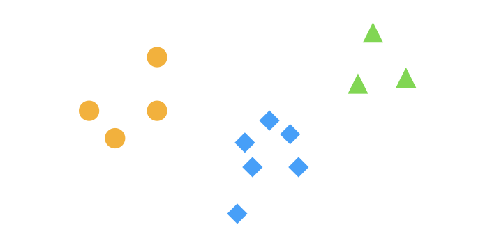

# Section 3

Plan: Review the core concepts of $\lambda$-calculus:
- variables/names
- binding
- substitution
- alpha-renaming
- beta-reduction

... by not talking about $\lambda$-calculus at all, until the very end.
$$~$$
$$~$$
$$~$$
$$~$$
$$~$$
$$~$$
$$~$$
$$~$$
$$~$$


## Names and Bindings

A *binding* is an **association of a name with an entity**.

Syntactically, there are 2 binding operations:
- ____, which ____ a name and (optionally) ____ the name with an entity. AKA a ____.
- ____, which uses a name to ____/____ the entity associated with the name.

Semantically, the meaning of a binding is given by ____, which means ____.

$$~$$
$$~$$
$$~$$
$$~$$
$$~$$
$$~$$

#### Example 1: variable binding in functional languages

OCaml
```ocaml
let x = 2 in 
let y = x + 1 in
x * y
```
Syntactically speaking:
1. The first `let` ____ the name `x`, and ____ it with the OCaml value `2`
2. On the right-hand-side of the second `let`, we use the name `x` to ____ the value associated with `x`. 
3. Then, we ____ name `y` and ____ it with the value of `x + 1`.
4. Finally, the last line uses the names `x` and `y` to ____ the values associated with them.

__How to interpret the meaning of this program?__

There are two levels of meaning:
1. Meaning of ____
2. Meaning of ____

The meaning of (1) is given by ____. 

$$~$$
$$~$$
$$~$$
$$~$$
$$~$$
$$~$$

#### Example 2: variable assignment in imperative languages

Binding declaration == Name <-> Entities

- For variables in OCaml, entities == ____.

- For variables in imperative languages, entities == ____.

```java
int x = 2;
x = x + 1
```
Surprisingly, this is also an instance of binding, except that a name is now associated with a *mutable memory box* that can be initialized, read, and updated:

1. With `int x = 2`, we create a binder by declaring a new name `x`, and associate it with ____.  Then, we ____ with the value `2`.
  
2. With `x = x + 1`, 
   - on the right-hand-side of `=`, we use `x` to ____, and then ____ the value stored in the memory box
   - on the left-hand-side of `=`, we use `x` to ____, but this time we ____ the value of `x+1` into memory box.  

$$~$$
$$~$$
$$~$$
$$~$$
$$~$$
$$~$$

### Scope

For a binding x <-> e,

Scope == how long `x` is ____ with `e`.

In programming languages, "how long" is measured in terms of ____.

$$~$$
$$~$$
$$~$$
$$~$$
$$~$$
$$~$$

#### Example: Variable scope in OCaml

Consider the following OCaml program:
```ocaml
let y = 
    (let x = e1 in e2) 
in e3
```

Declarations:
1. x <-> ____
   - Scope: 
2. y <-> ____
   - Scope: 

$$~$$
$$~$$
$$~$$
$$~$$
$$~$$
$$~$$

#### Example: Variable scope in imperative for-loops

**Exercise**: Consider the following Java program:
```java
<P>
for (int i = 0; i < 10; i++) {
    System.out.println(i);
}
<Q>
```
where `<P>` and `<Q>` are arbitrary Java programs.

$$~$$
$$~$$
$$~$$
$$~$$
$$~$$
$$~$$

#### Example: Bindings in math

We said:
```
Binding declaration == NAME <-> ENTITY in SCOPE
```
But actually,

```
Binding declaration == NAME <-> ~~ENTITY~~ in SCOPE
```

Prime example, in math:
$$
f(x, y) = xy + 1
$$

**Exercise**: What is the scope of $x$ in the above equation?


Q. When does NAME <-> ENTITY happen?

A. When you ____ the function with an ____.

$$
f(2,3) = 2 \times 3 + 1
$$

Besides function notation, bindings are quite ubiquitous in math and logic. Here are some more examples:
1. $$\int_0^1 \int_1^{y+1} 3x^2 + 4y\ dx\ dy$$

$$~$$
$$~$$
$$~$$
$$~$$
$$~$$
$$~$$

2. 
    $$\forall x. \exists y. (x+y) = 0 \implies x = 0$$


$$~$$
$$~$$
$$~$$
$$~$$
$$~$$
$$~$$

### Free and Bound References

We have seen

1. Binding == Declaration | Reference

2. Declaration == NAME <-> ENTITY in SCOPE

Suppose we have 

declaration == `x` <-> `e` in `s`

If we use the name `x` as a **reference** in `s`, `x` would refer to ____.

What if we use the name some other `y` in x? What does `y` refer to?


- A referenced name is ____ in an expression if it has not been ____. 

- A referenced name is ____ if it is not free, i.e., it has been declared to be in scope. 


Note that freeness and bound-ness are properties of ____, not of ____!

$$~$$
$$~$$
$$~$$
$$~$$
$$~$$
$$~$$

#### Example: Bindings in natural languages

From OpenAI's ChatGPT Terms of Use:
> You may provide input to the *Services* ("**Input**"), and receive output from the *Services* based on the *Input* ("**Output**"). *Input* and *Output* are collectively "**Content**." 
> 
>  If you do not want us to use your *Content* to train our models, you can opt out by following the instructions in this Help Center article. Please note that in some cases this may limit the ability of our *Services* to better address your specific use case.


$$~$$
$$~$$
$$~$$
$$~$$
$$~$$
$$~$$

#### Example: Equations in maths


$$
\begin{cases}
3x + 5y = 2 \\
x + 2y = 1
\end{cases}
$$

What does the above mean?


$$
\textsf{let}\ x = 2\ \textsf{in}\
\textsf{let}\ y = 1\ \textsf{in}\
\begin{cases}
3x + 5y = 2 \\
x + 2y = 1
\end{cases}
$$

What does the above mean?


If a reference is bound, its meaning is given by ____.

Otherwise, its meaning is ____.

$$~$$
$$~$$
$$~$$
$$~$$
$$~$$
$$~$$

#### Example 5: lambda calculus


$$
\begin{array}{rcll}
e & ::= & x & \text{variable} \\
& \mid & \lambda x. e & \text{abstraction} \\
& \mid & e\ e & \text{application}
\end{array} 
$$

Recall:
- Syntax of Binding == ____ | ____
- Semantics of Binding == ____


The upshot is that lambda calculus is just a language for ____.

$$~$$
$$~$$
$$~$$
$$~$$
$$~$$
$$~$$

**Exercise**: For each of the following expressions, determine
- all the places where some variable is declared
- the scope of each variable
- all the places where some variable is referenced
- which variable references are free in which parts of the expression
- which variable references are bound in which parts of the expression

1. $(\lambda y. (\lambda x. x + y)\ y)$
2. $(\lambda f. \lambda x. f\ x) (\lambda x. x + 1)\ 1$
3. $(\lambda f. (\lambda x. f\ x\ y))\ f$

$$~$$
$$~$$
$$~$$
$$~$$
$$~$$
$$~$$

### Alpha-Renaming

In bindings, names have only one purpose: ____.

So they are like ____.

Thus, the specific choice of names should not matter!

Intuition: If you consistently replaced the name of variables or functional parameters with something else, the resulting program should be ____.


This notion of "sameness-under-renaming" is captured by *alpha-renaming* and *alpha-equivalence*:


- Let $p$ and $q$ be arbitrary expressions in some language. An *alpha-renaming* of $p$ into $q$ is a substitution of all declared names and their bound references in $p$ into declared names and their bound references in $q$. 
  - We write $p \to_\alpha q$ to denote that $p$ can be alpha-renamed into $q$.

- Furthermore, $p$ and $q$ are said to be *alpha-equivalent* if $p \to_\alpha q$ and $q \to_\alpha p$. That is, you can replace all bound names in $p$ to get $q$, and symmetrically you can replace all bound names in $q$ to get $p$. 
  - We write $p =_\alpha q$ to denote that $p$ and $q$ are alpha-equivalent.

An important point is that an alpha-renaming does not touch the ____ references in $p$.


$$~$$
$$~$$
$$~$$
$$~$$
$$~$$
$$~$$

#### Example: alpha-renaming in OCaml
Recall:
```ocaml
let x = 2 in
let y = x + 1 in
x * y
```

Compare this to 
```ocaml
let hello = 2 in
let world = hello + 1 in
hello * world
```
- Are these two programs exactly the same?
- Are these two programs essentially same for all practical purposes?

$$~$$
$$~$$
$$~$$
$$~$$
$$~$$
$$~$$

Consider:
```ocaml
let x = 2 in
let y = x + 1 in
x * y
```
and 
```ocaml
let hello = 2 in
let world = hello + 1 in
x * world
```
- Are these two programs exactly the same?
- Are these two programs essentially same for all practical purposes?

$$~$$
$$~$$
$$~$$
$$~$$
$$~$$
$$~$$

Consider:
```ocaml
let x = 2 in
let y = x + 1 in
x * y
```
and
```ocaml
let hello = 2 in 
let hello = hello + 1 in
hello * hello
```
- Are these two programs exactly the same?
- Are these two programs essentially same for all practical purposes?
    


$$~$$
$$~$$
$$~$$
$$~$$
$$~$$
$$~$$

#### Example: alpha-renaming in OCaml (bad)

We said

> Alpha-renaming only rename ____ references, and respects the ____ references.

But why?

Consider
```ocaml
let x = 2 in
print_int(x + y)
```

Let's say we "renamed" it into
```ocaml
let y = 2 in
print_int(y + z)
```


Suppose there's a previous context:
```ocaml
let y = 100 in 
let z = 1000 in
...
```


$$~$$
$$~$$
$$~$$
$$~$$
$$~$$
$$~$$


**Exercise**: For each of the pair (P1, P2) of expressions below, determine whether they are alpha-equivalent.
- If they are, give a pair of alpha-renaming that witnesses the alpha-equivalence. 
- If they are not, explain why not, and come up with a third expression P3 that is alpha-equivalent to the first expression P1.

1. Consider P1 = 
    ```ocaml
    let x = 2 in 
    let y = (x + 1 in x) in 
    x * y
    ```
    and P2 =
    ```ocaml
    let y = 2 in
    let x = (y + 1 in y) in
    y * x
    ```

$$~$$
$$~$$
$$~$$
$$~$$
$$~$$
$$~$$

2. Consider P1 =
    ```ocaml
    let x = 2 in 
    let y = (x + 1 in x) in 
    x * y
    ```
    and P2 = 
    ```ocaml
    let y = 2 in
    let x = (y + 1 in y) in
    x * y
    ```

$$~$$
$$~$$
$$~$$
$$~$$
$$~$$
$$~$$
3. Consider P1 = 
   ```math
   \int_0^1 \int_1^{y+1} 3x^2 + 4y\ dx\ dy
   ```
   and P2 = 
    ```math
    \int_1^{x+1} \int_0^1 3y^2 + 4x\ dy\ dx
    ```
$$~$$
$$~$$
$$~$$
$$~$$
$$~$$
$$~$$
4. Consider P1 = 
   > You may provide input to the *Services* ("**Input**"), and receive output from the *Services* based on the *Input* ("**Output**"). *Input* and *Output* are collectively "**Content**." 
   > 
   >  If you do not want us to use your *Content* to train our models, you can opt out by following the instructions in this Help Center article. Please note that in some cases this may limit the ability of our *Services* to better address your specific use case.

   and P2 =    
   > You may provide input to the *ChatGPTButIHaveNoIdeaHowItWorks* ("**YourPrivacy**"), and receive output from the *ChatGPTButIHaveNoIdeaHowItWorks* based on the *YourPrivacy* ("**NotPrivateAnymore**"). *YourPrivacy* and *NotPrivateAnymore* are collectively "**Stuff**."
   > 
   >  If you do not want us to use your *Stuff* to train our models, you can opt out by following the instructions in this Help Center article. Please note that in some cases this may limit the ability of our *ChatGPTButIHaveNoIdeaHowItWorks* to better address your specific use case.
   
   (Disclaimer: The second excerpt is just designed for practice and is in no way representative the author's view of ChatGPT, or LLMs in general.)

$$~$$
$$~$$
$$~$$
$$~$$
$$~$$
$$~$$
**Thought Experiment 1**: Is $=_\alpha$ an equivalence relation? That is, is it reflexive, symmetric, and transitive?


**Thought Experiment 2**: If you think $=_\alpha$ is an equivalence relation, can you come up with a plausible canonical form, such that all terms that are alpha-equivalent have the same representation?




$$~$$
$$~$$
$$~$$
$$~$$
$$~$$
$$~$$


### Substitution

The substitution operation replaces all ____ in a ____ with some ____. 

Usually written as ____.

In general, when do we substitution? When we want to ____.

In lambda calculus, when do we do substitution? When ____ is applied to some ____. AKA ____ in lambda calculus.


Examples:

1. `(x * y)` `[ x |-> 1 ]`

$$~$$
$$~$$
$$~$$
$$~$$
$$~$$
$$~$$
3. `(x * y)` `[ y |-> 2 ]`

$$~$$
$$~$$
$$~$$
$$~$$
$$~$$
$$~$$

4. `let x = 100 in x * y` `[ y |-> 2 ]`
$$~$$
$$~$$
$$~$$
$$~$$
$$~$$
$$~$$

5. `let x = 100 in x * y` `[ x |-> 1 ]`
$$~$$
$$~$$
$$~$$
$$~$$
$$~$$
$$~$$

6. `lambda x. x * y` `[ y |-> 2 ]`
$$~$$
$$~$$
$$~$$
$$~$$
$$~$$
$$~$$

7. `lambda x. x * y` `[ x |-> 1 ]`
$$~$$
$$~$$
$$~$$
$$~$$
$$~$$
$$~$$


8. `let x = 100 in x * y` `[ y |-> x ]`???
$$~$$
$$~$$
$$~$$
$$~$$
$$~$$
$$~$$


If someone proposes an implementation of substitution to you, a natural question you can interrogate about their implementation is: 

> If I have two programs that are ____, and if I perform ____, do they remain ____?

This property can be states more concisely as *substitution should preserve alpha-equivalence*: 

> if $c_1 =_\alpha c_2$, then $c_1[x \mapsto e] =_\alpha c_2[x \mapsto e]$ for any $x$ and $e$. 

A substitution that enjoys this property is called a ____ substitution. 


In terms of pictures...

Consider the space of all possible (programs | math expressions | natural language sentences | ...)


Alpha-equivalence gives us a partition:


A substitution is like an arrow:


A capture-avoiding substitution:


A bad/non-capture-avoiding substitution:


$$~$$
$$~$$
$$~$$
$$~$$
$$~$$
$$~$$

With this in mind, let's do this again:
`let x = 100 in x * y` `[ y |-> x ]`

What we know: 
> If two expressions are alpha-equivalent, then if we do the same substitution to both of them, they should remain alpha-equivalent.


Let's call c = `let x = 100 in x * y`.

We want to do `c [ y |-> x ]`.

Let's alpha-rename `c` into something equivalent.


$$~$$
$$~$$
$$~$$
$$~$$
$$~$$
$$~$$


Is  `let x = 100 in x * y` alpha-equivalent to:

`let z = 100 in z * yyy`?


$$~$$
$$~$$
$$~$$
$$~$$
$$~$$
$$~$$


Is  `let x = 100 in x * y` alpha-equivalent to:

`let z = 100 in z * y`?


$$~$$
$$~$$
$$~$$
$$~$$
$$~$$
$$~$$

Now let's do `let z = 100 in z * y` `[ y |-> x ]`. We get?